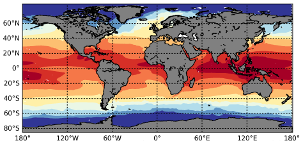

.. MPAS-Analysis documentation master file, created by
   sphinx-quickstart on Sat Mar 25 14:39:11 2017.
   You can adapt this file completely to your liking, but it should at least
   contain the root `toctree` directive.

MPAS-Analysis
=============

Analysis for simulations produced with Model for Prediction Across Scales
(MPAS) components and the Energy Exascale Earth System Model (E3SM), which
used those components.

.. toctree::
   :caption: User's guide
   :maxdepth: 2

   users_guide/quick_start
   users_guide/configuration
   users_guide/analysis_tasks
   users_guide/components
   users_guide/observations

.. toctree::
   :caption: Developer's guide
   :maxdepth: 2

   developers_guide/api

   design_docs/index

.. toctree::
   :caption: Tutorials
   :maxdepth: 1

   tutorials/getting_started
   tutorials/dev_getting_started
   tutorials/dev_understand_a_task
   tutorials/dev_add_task

.. toctree::
   :caption: Authors
   :maxdepth: 1

   authors

.. toctree::
   :caption: Versions
   :maxdepth: 1

   versions
