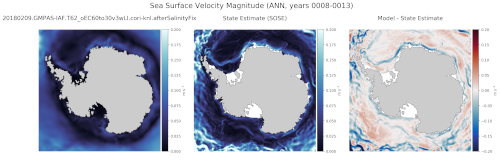

.. _task_climatologyMapSoseVelMag:

climatologyMapSoseVelMag
=============================

An analysis task for comparing velocity magnitude at various depths against
results from the `Southern Ocean State Estimate (SOSE)`_.

Component and Tags::

  component: ocean
  tags: climatology, horizontalMap, sose, velocity, magnitude

Configuration Options
---------------------

The following configuration options are available for this task::

  [climatologyMapSoseVelMag]
  ## options related to plotting climatology maps of Antarctic
  ## meridional against reference model results and SOSE reanalysis data

  # comparison grid(s)
  # only the Antarctic really makes sense but lat-lon could technically work.
  comparisonGrids = ['antarctic']

  # Months or seasons to plot (Jan, Feb, Mar, Apr, May, Jun, Jul, Aug, Sep, Oct,
  # Nov, Dec, JFM, AMJ, JAS, OND, ANN)
  seasons =  ['ANN','JFM','JAS']

  # list of depths in meters (positive up) at which to analyze, 'top' for the
  # sea surface, 'bot' for the sea floor
  depths = ['top', -200, -400, -600, -800, 'bot']

  # colormap for model/observations
  colormapNameResult = ice
  # color indices into colormapName for filled contours
  # the type of norm used in the colormap
  normTypeResult = linear
  # A dictionary with keywords for the SemiLogNorm
  normArgsResult = {'vmin': 0, 'vmax': 0.2}
  # determine the ticks automatically by default, uncomment to specify
  # colorbarTicksResult = numpy.linspace(0, 0.2, 9)

  # colormap for differences
  colormapNameDifference = balance
  # the type of norm used in the colormap
  normTypeDifference = linear
  # A dictionary with keywords for the SemiLogNorm
  normArgsDifference = {'vmin': -0.2, 'vmax': 0.2}
  # determine the ticks automatically by default, uncomment to specify
  # colorbarTicksDifference = numpy.linspace(-0.2, 0.2, 9)

For more details, see:
 * :ref:`config_colormaps`
 * :ref:`config_seasons`
 * :ref:`config_comparison_grids`

The option ``depths`` is a list of (approximate) depths at which to sample
the velocity magnitude field.  A value of ``'top'`` indicates the sea
surface (or the ice-ocean interface under ice shelves) while a value of
``'bot'`` indicates the seafloor.

State Estimate
--------------

:ref:`sose`

Example Result
--------------

.. _`Southern Ocean State Estimate (SOSE)`: http://sose.ucsd.edu/sose_stateestimation_data_05to10.html
