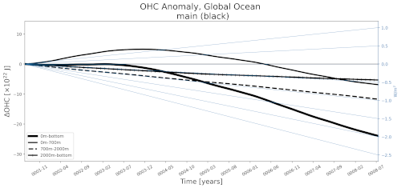

.. _task_timeSeriesOHCAnomaly:

timeSeriesOHCAnomaly
====================

An analysis task for plotting a Hovmoller plot (time and depth axes) and
depth-integrated time series of the anomaly in ocean heat content (OHC)
from a reference year (usully the first year of the simulation).

Component and Tags::

  component: ocean
  tags: timeSeries, ohc, publicObs

Configuration Options
---------------------

The following configuration options are available for this task::

  [timeSeriesOHCAnomaly]
  ## options related to plotting time series of ocean heat content (OHC)
  ## anomalies from year 1

  # list of regions to plot from the region list in [regions] below
  regions = ['global']

  # approximate depths (m) separating plots of the upper, middle and lower ocean
  depths = [700, 2000]

  # preprocessed file prefix, with format OHC.<preprocessedRunName>.year*.nc
  preprocessedFilePrefix = OHC

  # prefix on preprocessed field name, with format ohc_<suffix> for suffixes
  # 'tot', '700m', '2000m', 'btm'
  preprocessedFieldPrefix = ohc

  # Number of points over which to compute moving average(e.g., for monthly
  # output, movingAveragePoints=12 corresponds to a 12-month moving average
  # window)
  movingAveragePoints = 12

  # An optional first year for the tick marks on the x axis. Leave commented out
  # to start at the beginning of the time series.
  # firstYearXTicks = 1

  # An optional number of years between tick marks on the x axis.  Leave
  # commented out to determine the distance between ticks automatically.
  # yearStrideXTicks = 1

  [hovmollerOHCAnomaly]
  ## options related to time vs. depth Hovmoller plots of ocean heat content
  ## (OHC) anomalies from year 1

  # Note: regions and moving average points are the same as for the time series
  # plot

  # colormap
  colormapName = balance
  # colormap indices for contour color
  colormapIndices = [0, 28, 57, 85, 113, 142, 170, 198, 227, 255]
  # colorbar levels/values for contour boundaries
  colorbarLevels = [-2.4, -0.8, -0.4, -0.2, 0, 0.2, 0.4, 0.8, 2.4]
  # contour line levels
  contourLevels = np.arange(-2.5, 2.6, 0.5)

  # An optional first year for the tick marks on the x axis. Leave commented out
  # to start at the beginning of the time series.

  # firstYearXTicks = 1

  # An optional number of years between tick marks on the x axis.  Leave
  # commented out to determine the distance between ticks automatically.
  # yearStrideXTicks = 1

For the depth-integrated time-series plot, the user may select the depths (in
meters) that separate the upper, middle and lower regions of the ocean, e.g.::

  depths = [700, 2000]

indictes that OHC will be integrated from 0 to 700 m, 700 to 2000 m,
and 2000 m to the ocean floor (as well as from 0 to the ocean floor).

The OHC can be compared with results from a reference v0 simulation.  If
``preprocessedRunName`` in the ``[runs]`` section is not ``None``, the
depth integrated time series will be read in with a file prefix given by
``preprocessedFilePrefix`` and a field prefix given by
``preprocessedFieldPrefix``.  Generally, these options should not be altered
except of debugging purposes.

For more details on other config options, see:
 * :ref:`config_regions`
 * :ref:`config_colormaps`
 * :ref:`config_moving_average`
 * :ref:`config_time_axis_ticks`

Example Result
--------------

