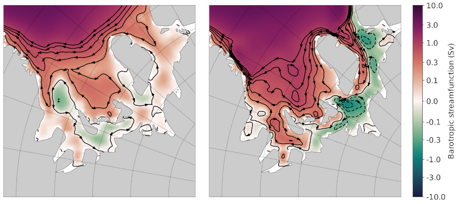

.. _tutorial_dev_add_task:

Developers: Adding a new analysis task
======================================

This tutorial walks a new developer through the basics of creating a new
analysis task in MPAS-Analysis.  It is a common practice to find an existing
analysis task that is as close as possible to the new analysis, and to copy
that existing task as a template for the new task.  That is the strategy we
will demonstrate here.

.. note::

   The changes will not be broadly available until the next MPAS-Analysis
   release and to the broader E3SM community after the next
   `E3SM-Unified <https://github.com/E3SM-Project/e3sm-unified>`_ release.

To provide a real example, we will show how we copy and modify an analysis
task used to compute the anomaly in ocean heat content
(:py:class:`~mpas_analysis.ocean.ClimatologyMapOHCAnomaly`) to instead compute
the barotropic streamfunction (BSF).

For computing the BSF itself, we will make use of a script that was developed
outside of MPAS-Analysis for this purpose.  This is also a common development
technique: first develop the analysis as a script or
`jupyter notebook <https://jupyter.org/>`_. Nearly always, the scripts or
notebooks include hard-coded paths and are otherwise not easily applied to new
simulations without considerable effort. This is the motivation for adapting
the code to MPAS-Analysis.


.. note::

   If one just wishes to add a new field that already exists in MPAS-Ocean or
   MPAS-Seaice output, only a few of the steps below are necessary:

   1. Follow step 1 to set up an ```mpas_analysis_dev``` environment.
   2. Copy an existing `ocean <https://github.com/MPAS-Dev/MPAS-Analysis/tree/develop/mpas_analysis/ocean>`_
      or `sea_ice <https://github.com/MPAS-Dev/MPAS-Analysis/tree/develop/mpas_analysis/sea_ice>`_
      python module to a new name and edit it as needed for the new fields.
   3. Follow step 6 to add config options
   4. Follow step 7 to add the task to the list of tasks known to
      MPAS-Analysis
   5. Follow step 8 to update Analysis Tasks in the user's guide and
      ``api.rst`` in the developer's guide to include the new analysis task.

1. Getting started
------------------

To begin, please follow the :ref:`tutorial_dev_getting_started` tutorial, which
will help you through the basics of creating a fork of MPAS-Analysis,
cloning it onto the machine(s) where you will do your development, making
a worktree for the feature you will develop, creating a conda environment for
testing your new MPAS-Analysis development, and running MPAS-Analysis.

.. note::

   Make sure you follow the tutorial for developers, not for users, since the
   tutorial for users installs the latest release of MPAS-Analysis, which you
   cannot modify. Similarly, changes must be tested in your own development
   environment (often called ``mpas_analysis_dev``) rather than the in a shared
   environment like `E3SM-Unified <https://github.com/E3SM-Project/e3sm-unified>`_.

Then, please follow the :ref:`tutorial_understand_a_task`.  This will give
you a tour of the :py:class:`~mpas_analysis.ocean.ClimatologyMapOHCAnomaly`
analysis task that we will use as a starting point for developing a new task.


2. The reference scripts
------------------------

I have two scripts I used in the past to compute the barotropic streamfunction
and write it out, and then to plot it.  These scripts yanked out some code
from MPAS-Analysis so there are a few similarities but there's a lot of work
to do.

Here's the script for computing the BSF:

.. code-block:: python

    #!/usr/bin/env python

    import xarray
    import numpy
    import scipy.sparse
    import scipy.sparse.linalg
    import sys

    from mpas_tools.io import write_netcdf


    def main():

        ds = xarray.open_dataset(sys.argv[1])
        ds = ds[['timeMonthly_avg_layerThickness',
                 'timeMonthly_avg_normalVelocity']]
        ds.load()

        dsMesh = xarray.open_dataset(sys.argv[2])
        dsMesh = dsMesh[['cellsOnEdge', 'cellsOnVertex', 'nEdgesOnCell',
                         'edgesOnCell', 'verticesOnCell', 'verticesOnEdge',
                         'dcEdge', 'dvEdge', 'lonCell', 'latCell', 'lonVertex',
                         'latVertex']]
        dsMesh.load()

        out_filename = sys.argv[3]

        bsfVertex = _compute_barotropic_streamfunction_vertex(dsMesh, ds)
        print('bsf on vertices computed.')
        bsfCell = _compute_barotropic_streamfunction_cell(dsMesh, bsfVertex)
        print('bsf on cells computed.')
        dsBSF = xarray.Dataset()
        dsBSF['bsfVertex'] = bsfVertex
        dsBSF.bsfVertex.attrs['units'] = 'Sv'
        dsBSF.bsfVertex.attrs['description'] = 'barotropic streamfunction ' \
            'on vertices'
        dsBSF['bsfCell'] = bsfCell
        dsBSF.bsfCell.attrs['units'] = 'Sv'
        dsBSF.bsfCell.attrs['description'] = 'barotropic streamfunction ' \
            'on cells'
        dsBSF = dsBSF.transpose('Time', 'nCells', 'nVertices')
        for var in dsMesh:
            dsBSF[var] = dsMesh[var]
        write_netcdf(dsBSF, out_filename)


    def _compute_transport(dsMesh, ds):

        cellsOnEdge = dsMesh.cellsOnEdge - 1
        innerEdges = numpy.logical_and(cellsOnEdge.isel(TWO=0) >= 0,
                                       cellsOnEdge.isel(TWO=1) >= 0)

        # convert from boolean mask to indices
        innerEdges = numpy.flatnonzero(innerEdges.values)

        cell0 = cellsOnEdge.isel(nEdges=innerEdges, TWO=0)
        cell1 = cellsOnEdge.isel(nEdges=innerEdges, TWO=1)

        layerThickness = ds.timeMonthly_avg_layerThickness
        normalVelocity = ds.timeMonthly_avg_normalVelocity.isel(nEdges=innerEdges)

        layerThicknessEdge = 0.5*(layerThickness.isel(nCells=cell0) +
                                  layerThickness.isel(nCells=cell1))
        transport = dsMesh.dvEdge[innerEdges] * \
            (layerThicknessEdge * normalVelocity).sum(dim='nVertLevels')

        # ds = xarray.Dataset()
        # ds['transport'] = transport
        # ds['innerEdges'] = ('nEdges', innerEdges)
        # write_netcdf(ds, 'transport.nc')

        return innerEdges, transport


    def _compute_barotropic_streamfunction_vertex(dsMesh, ds):
        innerEdges, transport = _compute_transport(dsMesh, ds)
        print('transport computed.')

        nVertices = dsMesh.sizes['nVertices']
        nTime = ds.sizes['Time']

        cellsOnVertex = dsMesh.cellsOnVertex - 1
        verticesOnEdge = dsMesh.verticesOnEdge - 1
        isBoundaryCOV = cellsOnVertex == -1
        boundaryVertices = numpy.logical_or(isBoundaryCOV.isel(vertexDegree=0),
                                            isBoundaryCOV.isel(vertexDegree=1))
        boundaryVertices = numpy.logical_or(boundaryVertices,
                                            isBoundaryCOV.isel(vertexDegree=2))

        # convert from boolean mask to indices
        boundaryVertices = numpy.flatnonzero(boundaryVertices.values)

        nBoundaryVertices = len(boundaryVertices)
        nInnerEdges = len(innerEdges)

        indices = numpy.zeros((2, 2*nInnerEdges+nBoundaryVertices), dtype=int)
        data = numpy.zeros(2*nInnerEdges+nBoundaryVertices, dtype=float)

        # The difference between the streamfunction at vertices on an inner edge
        # should be equal to the transport
        v0 = verticesOnEdge.isel(nEdges=innerEdges, TWO=0).values
        v1 = verticesOnEdge.isel(nEdges=innerEdges, TWO=1).values

        ind = numpy.arange(nInnerEdges)
        indices[0, 2*ind] = ind
        indices[1, 2*ind] = v1
        data[2*ind] = 1.

        indices[0, 2*ind+1] = ind
        indices[1, 2*ind+1] = v0
        data[2*ind+1] = -1.

        # the streamfunction should be zero at all boundary vertices
        ind = numpy.arange(nBoundaryVertices)
        indices[0, 2*nInnerEdges + ind] = nInnerEdges + ind
        indices[1, 2*nInnerEdges + ind] = boundaryVertices
        data[2*nInnerEdges + ind] = 1.

        bsfVertex = xarray.DataArray(numpy.zeros((nTime, nVertices)),
                                     dims=('Time', 'nVertices'))

        for tIndex in range(nTime):
            rhs = numpy.zeros(nInnerEdges+nBoundaryVertices, dtype=float)

            # convert to Sv
            ind = numpy.arange(nInnerEdges)
            rhs[ind] = 1e-6*transport.isel(Time=tIndex)

            ind = numpy.arange(nBoundaryVertices)
            rhs[nInnerEdges + ind] = 0.

            M = scipy.sparse.csr_matrix((data, indices),
                                        shape=(nInnerEdges+nBoundaryVertices,
                                               nVertices))

            solution = scipy.sparse.linalg.lsqr(M, rhs)

            bsfVertex[tIndex, :] = -solution[0]

        return bsfVertex


    def _compute_barotropic_streamfunction_cell(dsMesh, bsfVertex):
        '''
        Interpolate the barotropic streamfunction from vertices to cells
        '''
        nEdgesOnCell = dsMesh.nEdgesOnCell
        edgesOnCell = dsMesh.edgesOnCell - 1
        verticesOnCell = dsMesh.verticesOnCell - 1
        areaEdge = 0.25*dsMesh.dcEdge*dsMesh.dvEdge

        nCells = dsMesh.sizes['nCells']
        maxEdges = dsMesh.sizes['maxEdges']

        areaVert = xarray.DataArray(numpy.zeros((nCells, maxEdges)),
                                    dims=('nCells', 'maxEdges'))

        for iVert in range(maxEdges):
            edgeIndices = edgesOnCell.isel(maxEdges=iVert)
            mask = iVert < nEdgesOnCell
            areaVert[:, iVert] += 0.5*mask*areaEdge.isel(nEdges=edgeIndices)

        for iVert in range(maxEdges-1):
            edgeIndices = edgesOnCell.isel(maxEdges=iVert+1)
            mask = iVert+1 < nEdgesOnCell
            areaVert[:, iVert] += 0.5*mask*areaEdge.isel(nEdges=edgeIndices)

        edgeIndices = edgesOnCell.isel(maxEdges=0)
        mask = nEdgesOnCell == maxEdges
        areaVert[:, maxEdges-1] += 0.5*mask*areaEdge.isel(nEdges=edgeIndices)

        bsfCell = ((areaVert * bsfVertex[:, verticesOnCell]).sum(dim='maxEdges') /
                   areaVert.sum(dim='maxEdges'))

        return bsfCell


    if __name__ == '__main__':
        main()

And here's the one for plotting it:

.. code-block:: python

    #!/usr/bin/env python

    import xarray
    import numpy
    import matplotlib
    import matplotlib.pyplot as plt
    import matplotlib.ticker as mticker
    import matplotlib.colors as cols
    from mpl_toolkits.axes_grid1 import make_axes_locatable
    import matplotlib.patches as mpatches
    import cmocean
    import cartopy
    import pyproj
    import os

    from pyremap import ProjectionGridDescriptor


    def get_antarctic_stereographic_projection():  # {{{
        """
        Get a projection for an Antarctic steregraphic comparison grid

        Returns
        -------
        projection : ``pyproj.Proj`` object
            The projection
        """
        # Authors
        # -------
        # Xylar Asay-Davis

        projection = pyproj.Proj('+proj=stere +lat_ts=-71.0 +lat_0=-90 +lon_0=0.0 '
                                 '+k_0=1.0 +x_0=0.0 +y_0=0.0 +ellps=WGS84')

        return projection  # }}}


    def get_fris_stereographic_comparison_descriptor():  # {{{
        """
        Get a descriptor of a region of a polar stereographic grid centered on the
        Filchner-Ronne Ice Shelf, used for remapping and determining the grid name

        Returns
        -------
        descriptor : ``ProjectionGridDescriptor`` object
            A descriptor of the FRIS comparison grid
        """
        # Authors
        # -------
        # Xylar Asay-Davis

        x = numpy.linspace(-1.6e6, -0.5e6, 1101)
        y = numpy.linspace(0., 1.1e6, 1101)
        Lx = 1e-3*(x[-1] - x[0])
        Ly = 1e-3*(y[-1] - y[0])
        dx = 1e-3*(x[1] - x[0])

        projection = get_antarctic_stereographic_projection()

        meshName = '{}x{}km_{}km_FRIS_stereo'.format(Lx, Ly, dx)
        descriptor = ProjectionGridDescriptor.create(projection, x, y, meshName)

        return descriptor  # }}}


    def add_land_lakes_coastline(ax):
        land_50m = cartopy.feature.NaturalEarthFeature(
                'physical', 'land', '50m', edgecolor='k',
                facecolor='#cccccc', linewidth=0.5)
        lakes_50m = cartopy.feature.NaturalEarthFeature(
                'physical', 'lakes', '50m', edgecolor='k',
                facecolor='white',
                linewidth=0.5)
        ax.add_feature(land_50m, zorder=2)
        ax.add_feature(lakes_50m, zorder=4)


    def add_arrow_to_line2D(ax, path, arrow_spacing=100e3,):
        """
        https://stackoverflow.com/a/27637925/7728169
        Add arrows to a matplotlib.lines.Line2D at selected locations.

        Parameters:
        -----------
        axes:
        line: list of 1 Line2D object as returned by plot command
        arrow_spacing: distance in m between arrows

        Returns:
        --------
        arrows: list of arrows
        """
        v = path.vertices
        x = v[:, 0]
        y = v[:, 1]

        arrows = []
        s = numpy.cumsum(numpy.sqrt(numpy.diff(x) ** 2 + numpy.diff(y) ** 2))
        indices = numpy.searchsorted(s, arrow_spacing*numpy.arange(1,
            int(s[-1]/arrow_spacing)))
        for n in indices:
            dx = numpy.mean(x[n-2:n]) - x[n]
            dy = numpy.mean(y[n-2:n]) - y[n]
            p = mpatches.FancyArrow(
                x[n], y[n], dx, dy, length_includes_head=False, width=4e3,
                facecolor='k')
            ax.add_patch(p)
            arrows.append(p)
        return arrows


    def savefig(filename, tight=True, pad_inches=0.1, plot_pdf=True):
        """
        Saves the current plot to a file, then closes it.
        Parameters
        ----------
        filename : str
            the file name to be written
        config :  mpas_analysis.configuration.MpasAnalysisConfigParser
            Configuration options
        tight : bool, optional
            whether to tightly crop the figure
        pad_inches : float, optional
            The boarder around the image
        """
        # Authors
        # -------
        # Xylar Asay-Davis

        if tight:
            bbox_inches = 'tight'
        else:
            bbox_inches = None

        filenames = [filename]

        if plot_pdf:
            pdf_filename = '{}.pdf'.format(os.path.splitext(filename)[0])
            filenames.append(pdf_filename)

        for path in filenames:
            plt.savefig(path, dpi='figure', bbox_inches=bbox_inches,
                        pad_inches=pad_inches)

        plt.close()


    descriptor = get_fris_stereographic_comparison_descriptor()

    projection = cartopy.crs.Stereographic(
        central_latitude=-90., central_longitude=0.0,
        true_scale_latitude=-71.0)

    matplotlib.rc('font', size=14)

    x = descriptor.x_corner
    y = descriptor.y_corner

    extent = [x[0], x[-1], y[0], y[-1]]

    dx = x[1] - x[0]
    dy = y[1] - y[0]

    fig = plt.figure(figsize=[15, 7.5], dpi=200)

    titles = ['control (yrs 51-60)', 'control (yrs 111-120)']

    for index, yrs in enumerate(['0051-0060', '0111-0120']):
        filename = 'control/bsf_{}_1100.0x1100.0km_1.0km_' \
                   'FRIS_stereo_patch.nc'.format(yrs)
        with xarray.open_dataset(filename) as ds:

            ds = ds.isel(Time=0)

            bsf = ds.bsfVertex
            bsf = bsf.where(bsf != 0.).values

        #u = 1e6*(bsf[2:, 1:-1] - bsf[:-2, 1:-1])/dy
        #v = -1e6*(bsf[1:-1, 2:] - bsf[1:-1, :-2])/dx

        #x = 0.5*(x[1:-2] + x[2:-1])
        #y = 0.5*(y[1:-2] + y[2:-1])

        xc = 0.5*(x[0:-1] + x[1:])
        yc = 0.5*(y[0:-1] + y[1:])

        ax = fig.add_subplot(121+index, projection=projection)

        ax.set_title(titles[index], y=1.06, size=16)

        ax.set_extent(extent, crs=projection)

        gl = ax.gridlines(crs=cartopy.crs.PlateCarree(), color='k',
                          linestyle=':', zorder=5, draw_labels=False)
        gl.xlocator = mticker.FixedLocator(numpy.arange(-180., 181., 10.))
        gl.ylocator = mticker.FixedLocator(numpy.arange(-88., 81., 2.))
        gl.n_steps = 100
        gl.rotate_labels = False
        gl.x_inline = False
        gl.y_inline = False
        gl.xformatter = cartopy.mpl.gridliner.LONGITUDE_FORMATTER
        gl.yformatter = cartopy.mpl.gridliner.LATITUDE_FORMATTER
        gl.left_labels = False
        gl.right_labels = False

        add_land_lakes_coastline(ax)

        norm = cols.SymLogNorm(linthresh=0.1, linscale=0.5, vmin=-10., vmax=10.)
        ticks = [-10., -3., -1., -0.3, -0.1, 0., 0.1, 0.3, 1., 3., 10.]

        levels = numpy.linspace(-1., 1., 11)

        handle = plt.pcolormesh(x, y, bsf, norm=norm, cmap='cmo.curl',
                                rasterized=True)

        cs = plt.contour(xc, yc, bsf, levels=levels, colors='k')

        for collection in cs.collections:
            for path in collection.get_paths():
                add_arrow_to_line2D(ax, path)

        divider = make_axes_locatable(ax)
        cax = divider.append_axes("right", size="5%", pad=0.1,
                                  axes_class=plt.Axes)
        if index < 1:
            cax.set_axis_off()
        else:
            cbar = plt.colorbar(handle, cax=cax)
            cbar.set_label('Barotropic streamfunction (Sv)')
            cbar.set_ticks(ticks)
            cbar.set_ticklabels(['{}'.format(tick) for tick in ticks])

Here's a plot that I think was produced with this code (but I'm not 100% sure).



3. Selecting an existing task to copy
-------------------------------------

I selected :py:class:`~mpas_analysis.ocean.ClimatologyMapOHCAnomaly` as the
analysis task that was closest to what I envision for a new
``ClimatologyMapBSF`` task.  Here were my thoughts:

* Both OHC and BSF plot 2D fields (as opposed to some of the analysis like
  WOA, Argo and SOSE that work with 3D temperature, salinity and sometimes
  other fields).

* Neither OHC nor BSF have observations to compare with.

* Both OHC and BSF require computing a new field, rather than directly using
  output from MPAS-Ocean.

On the other hand, there are some major differences between the 2 that will
mean my job isn't a simple substitution:

* While OHC is computed over different depth ranges, we do not want that for
  the BSF analysis.

* We will eventually want some "fancier" plotting for the BSF that draws
  streamlines with arrows.  That's not currently available in any MPAS-Analysis
  tasks.

* OHC involves computing an anomaly, but that isn't anything we need for BSF.

Even so, :py:class:`~mpas_analysis.ocean.ClimatologyMapOHCAnomaly` seems like
a reasonable starting point.

4. Developing the task
----------------------

I'll start just by making a new worktree, then copying the "template" analysis
task to the new name:

.. code-block:: bash

    git worktree add ../add_climatology_map_bsf
    cd ../add_climatology_map_bsf
    cp mpas_analysis/ocean/climatology_map_ohc_anomaly.py mpas_analysis/ocean/climatology_map_bsf.py

Then, I'll open this new worktree in VS Code.  (You can, of course, use
whatever editor you like.)

.. code-block:: bash

    code .

I'll create or recreate my ``mpas_analysis_dev`` environment as in
:ref:`tutorial_dev_getting_started`, and then make sure to at least do:

.. code-block:: bash

    conda activate mpas_analysis_dev
    python -m pip install --no-deps --no-build-isolation -e .

This last command installs the ``mpas_analysis`` package into the conda
environment.

4.1 ``ClimatologyMapBSF`` class
-------------------------------

In the editor, I rename the class from ``ClimatologyMapOHCAnomaly`` to
``ClimatologyMapBSF`` and task name from ``climatologyMapOHCAnomaly`` to
``climatologyMapBSF``.

Then, I update the docstring right away because otherwise I'll forget!

.. code-block:: python

    class ClimatologyMapBSF(AnalysisTask):
        """
        An analysis task for computing and plotting maps of the barotropic
        streamfunction (BSF)

        Attributes
        ----------
        mpas_climatology_task : mpas_analysis.shared.climatology.MpasClimatologyTask
            The task that produced the climatology to be remapped and plotted
        """

I keep the ``mpas_climatology_task`` attribute because I'm going to need a
climatology of the velocity field and layer thicknesses that I will get from
that task, but I know I won't need the ``ref_year_climatology_task`` attribute
so I get rid of it.

4.2 Constructor
~~~~~~~~~~~~~~~

Then, I move on to the constructor.  The main things I need to do besides
renaming the task are:

* rename the field I'm processing to ``barotropicStreamfunction``.

* clean up the ``tags`` a little bit (change ``anomaly`` to ``streamfunction``).

* get rid of ``ref_year_climatology_task`` since I'm not computing anomalies.

* get rid of ``depth_range`` because I'm using only the full ocean column.

.. code-block:: python

   def __init__(self, config, mpas_climatology_task, control_config=None):
        """
        Construct the analysis task.

        Parameters
        ----------
        config : mpas_tools.config.MpasConfigParser
            Configuration options

        mpas_climatology_task : mpas_analysis.shared.climatology.MpasClimatologyTask
            The task that produced the climatology to be remapped and plotted

        control_config : mpas_tools.config.MpasConfigParser, optional
            Configuration options for a control run (if any)
        """

        field_name = 'barotropicStreamfunction'
        # call the constructor from the base class (AnalysisTask)
        super().__init__(config=config, taskName='climatologyMapBSF',
                         componentName='ocean',
                         tags=['climatology', 'horizontalMap', field_name,
                               'publicObs', 'streamfunction'])

        self.mpas_climatology_task = mpas_climatology_task

        section_name = self.taskName

        # read in what seasons we want to plot
        seasons = config.getexpression(section_name, 'seasons')

        if len(seasons) == 0:
            raise ValueError(f'config section {section_name} does not contain '
                             f'valid list of seasons')

        comparison_grid_names = config.getexpression(section_name,
                                                     'comparisonGrids')

        if len(comparison_grid_names) == 0:
            raise ValueError(f'config section {section_name} does not contain '
                             f'valid list of comparison grids')

Next, I need to update the ``mpas_field_name`` (which I can choose since I'm
computing the field here, it's not something produced by MPAS-Ocean).  And then
I need to specify the fields from the ``timeSeriesStatsMonthlyOutput`` data
that I will use in the computation:

.. code-block:: python

        mpas_field_name = field_name

        variable_list = ['timeMonthly_avg_normalVelocity',
                         'timeMonthly_avg_layerThickness']

In the next block of code, I:

* get rid of the for-loop over depth ranges and unindent the code that was in
  it.

* rename ``RemapMpasOHCClimatology`` to ``RemapMpasBSFClimatology`` (we will
  get to this in section 5)

* make my best guess about the arguments I do and don't need for the
  constructor of ``RemapMpasBSFClimatology``

.. code-block:: python

        remap_climatology_subtask = RemapMpasBSFClimatology(
            mpas_climatology_task=mpas_climatology_task,
            parent_task=self,
            climatology_name=field_name,
            variable_list=variable_list,
            comparison_grid_names=comparison_grid_names,
            seasons=seasons)

        self.add_subtask(remap_climatology_subtask)

In the remainder of the constructor, I

* update things like the name of the field being plotted and the units

* continue to get rid of things related to depth range

.. code-block:: python

        out_file_label = field_name
        remap_observations_subtask = None
        if control_config is None:
            ref_title_label = None
            ref_field_name = None
            diff_title_label = 'Model - Observations'

        else:
            control_run_name = control_config.get('runs', 'mainRunName')
            ref_title_label = f'Control: {control_run_name}'
            ref_field_name = mpas_field_name
            diff_title_label = 'Main - Control'

        for comparison_grid_name in comparison_grid_names:
            for season in seasons:
                # make a new subtask for this season and comparison grid
                subtask_name = f'plot{season}_{comparison_grid_name}'

                subtask = PlotClimatologyMapSubtask(
                    self, season, comparison_grid_name,
                    remap_climatology_subtask, remap_observations_subtask,
                    controlConfig=control_config, subtaskName=subtask_name)

                subtask.set_plot_info(
                    outFileLabel=out_file_label,
                    fieldNameInTitle=f'Barotropic Streamfunction',
                    mpasFieldName=mpas_field_name,
                    refFieldName=ref_field_name,
                    refTitleLabel=ref_title_label,
                    diffTitleLabel=diff_title_label,
                    unitsLabel='Sv',
                    imageCaption='Barotropic Streamfunction',
                    galleryGroup='Barotropic Streamfunction',
                    groupSubtitle=None,
                    groupLink='bsf',
                    galleryName=None)

                self.add_subtask(subtask)

This will result in a "gallery" on the web page called "Barotropic
Streamfunction" with a single image in it.  That seems a little silly but
we'll change that later if we feel the need.

4.3 ``setup_and_check()`` method
~~~~~~~~~~~~~~~~~~~~~~~~~~~~~~~~

In the OHC analysis task, we needed to check if the reference year for the
anomaly and the climatology year were different from one another.  We don't
need this check for the BSF because we're not computing an anomaly here.  So
we can get rid of the ``setup_and_check()`` method entirely and the version
from ``AnalysisTask`` (the superclass) will be called automatically.

At this point, I commit my changes even though I'm less than halfway done.

.. code-block:: bash

    git add mpas_analysis/ocean/climatology_map_bsf.py
    git commit

I can always do

.. code-block:: bash

    git commit --amend mpas_analysis/ocean/climatology_map_bsf.py

to keep adding changes to my commit as I go.

5. Developing a subtask
-----------------------

Similarly to how ``RemapMpasOHCClimatology`` computes the ocean heat content,
we need a class for computing the barotropic streamfunction before we remap
to the comparison grid.  In general, it is important to perform computations
on the native MPAS mesh before remapping to the comparison grid but in the
case of the barotropic streamfunction, this is especially true.  Any attempt
to compute this analysis directly on the comparison grid (e.g. using remapped,
reconstructed velocity components) would be woefully inaccurate.

5.1 ``RemapMpasBSFClimatology`` class
~~~~~~~~~~~~~~~~~~~~~~~~~~~~~~~~~~~~~

We start by renaming the class from ``RemapMpasOHCClimatology`` to
``RemapMpasBSFClimatology``, updating the docstring, removing the unneeded
attributes:

.. code-block:: python

    class RemapMpasBSFClimatology(RemapMpasClimatologySubtask):
        """
        A subtask for computing climatologies of the barotropic streamfunction
        from climatologies of normal velocity and layer thickness
        """

3.2 Constructor
~~~~~~~~~~~~~~~

I started by taking out all of the unneeded parameters from the constructor.
What I was left with was simply a call to the constructor of the superclass
:py:class:`~mpas_analysis.shared.climatology.RemapMpasClimatologySubtask`.
In such a case, there is no point in overriding the constructor.  We should
simply leave the constructor for the superclass.  The main difference is that
I had switched away from mixed capitalization in the
``RemapMpasOHCClimatology`` to conform to the PEP8 style guide.  The superclass
still uses mixed case so we will have to change the call in
``ClimatologyMapBSF`` just a little:


.. code-block:: python

        remap_climatology_subtask = RemapMpasBSFClimatology(
            mpasClimatologyTask=mpas_climatology_task,
            parentTask=self,
            climatologyName=field_name,
            variableList=variable_list,
            comparisonGridNames=comparison_grid_names,
            seasons=seasons)

5.3 ``setup_and_check()`` method
~~~~~~~~~~~~~~~~~~~~~~~~~~~~~~~~

The same turns out to be true of ``setup_and_check()``.  As soon as I get rid
of everything we no longer need in the BSF version, all I am left with is a
call to the superclass' version, and in that case we might as well get rid of
the method entirely.

5.4 ``customize_masked_climatology()`` method
~~~~~~~~~~~~~~~~~~~~~~~~~~~~~~~~~~~~~~~~~~~~~

Finally, we've gotten to the part where the real work will take place!

The sub task will run in the same way as described in
:ref:`tutorial_understand_a_task_subtask_run_task` of the
:ref:`tutorial_understand_a_task` tutorial.  In the process, the
``customize_masked_climatology()`` method will get called and that's our chance
to make some changes.

Before writing that method, first, I copy the 3 helper functions
``_compute_transport()``, ``_compute_barotropic_streamfunction_vertex()``, and
``_compute_barotropic_streamfunction_cell()`` from my example script.  Other
than making them methods instead of functions and cleaning up the syntax a bit
so they conform to the PEP8 style guide, I leave them unchanged:

.. code-block:: python

    def _compute_transport(self, ds_mesh, ds):

        cells_on_edge = ds_mesh.cellsOnEdge - 1
        inner_edges = np.logical_and(cells_on_edge.isel(TWO=0) >= 0,
                                     cells_on_edge.isel(TWO=1) >= 0)

        # convert from boolean mask to indices
        inner_edges = np.flatnonzero(inner_edges.values)

        cell0 = cells_on_edge.isel(nEdges=inner_edges, TWO=0)
        cell1 = cells_on_edge.isel(nEdges=inner_edges, TWO=1)

        layer_thickness = ds.timeMonthly_avg_layerThickness
        normal_velocity = \
            ds.timeMonthly_avg_normalVelocity.isel(nEdges=inner_edges)

        layer_thickness_edge = 0.5*(layer_thickness.isel(nCells=cell0) +
                                    layer_thickness.isel(nCells=cell1))
        transport = ds_mesh.dvEdge[inner_edges] * \
            (layer_thickness_edge * normal_velocity).sum(dim='nVertLevels')

        return inner_edges, transport

    def _compute_barotropic_streamfunction_vertex(self, ds_mesh, ds):
        inner_edges, transport = self._compute_transport(ds_mesh, ds)
        print('transport computed.')

        nvertices = ds_mesh.sizes['nVertices']
        ntime = ds.sizes['Time']

        cells_on_vertex = ds_mesh.cellsOnVertex - 1
        vertices_on_edge = ds_mesh.verticesOnEdge - 1
        is_boundary_cov = cells_on_vertex == -1
        boundary_vertices = np.logical_or(is_boundary_cov.isel(vertexDegree=0),
                                          is_boundary_cov.isel(vertexDegree=1))
        boundary_vertices = np.logical_or(boundary_vertices,
                                          is_boundary_cov.isel(vertexDegree=2))

        # convert from boolean mask to indices
        boundary_vertices = np.flatnonzero(boundary_vertices.values)

        n_boundary_vertices = len(boundary_vertices)
        n_inner_edges = len(inner_edges)

        indices = np.zeros((2, 2*n_inner_edges+n_boundary_vertices), dtype=int)
        data = np.zeros(2*n_inner_edges+n_boundary_vertices, dtype=float)

        # The difference between the streamfunction at vertices on an inner
        # edge should be equal to the transport
        v0 = vertices_on_edge.isel(nEdges=inner_edges, TWO=0).values
        v1 = vertices_on_edge.isel(nEdges=inner_edges, TWO=1).values

        ind = np.arange(n_inner_edges)
        indices[0, 2*ind] = ind
        indices[1, 2*ind] = v1
        data[2*ind] = 1.

        indices[0, 2*ind+1] = ind
        indices[1, 2*ind+1] = v0
        data[2*ind+1] = -1.

        # the streamfunction should be zero at all boundary vertices
        ind = np.arange(n_boundary_vertices)
        indices[0, 2*n_inner_edges + ind] = n_inner_edges + ind
        indices[1, 2*n_inner_edges + ind] = boundary_vertices
        data[2*n_inner_edges + ind] = 1.

        bsf_vertex = xr.DataArray(np.zeros((ntime, nvertices)),
                                  dims=('Time', 'nVertices'))

        for tindex in range(ntime):
            rhs = np.zeros(n_inner_edges+n_boundary_vertices, dtype=float)

            # convert to Sv
            ind = np.arange(n_inner_edges)
            rhs[ind] = 1e-6*transport.isel(Time=tindex)

            ind = np.arange(n_boundary_vertices)
            rhs[n_inner_edges + ind] = 0.

            matrix = scipy.sparse.csr_matrix(
                (data, indices),
                shape=(n_inner_edges+n_boundary_vertices, nvertices))

            solution = scipy.sparse.linalg.lsqr(matrix, rhs)

            bsf_vertex[tindex, :] = -solution[0]

        return bsf_vertex

    def _compute_barotropic_streamfunction_cell(self, ds_mesh, bsf_vertex):
        """
        Interpolate the barotropic streamfunction from vertices to cells
        """
        n_edges_on_cell = ds_mesh.nEdgesOnCell
        edges_on_cell = ds_mesh.edgesOnCell - 1
        vertices_on_cell = ds_mesh.verticesOnCell - 1
        area_edge = 0.25*ds_mesh.dcEdge*ds_mesh.dvEdge

        ncells = ds_mesh.sizes['nCells']
        max_edges = ds_mesh.sizes['maxEdges']

        area_vert = xr.DataArray(np.zeros((ncells, max_edges)),
                                 dims=('nCells', 'maxEdges'))

        for ivert in range(max_edges):
            edge_indices = edges_on_cell.isel(maxEdges=ivert)
            mask = ivert < n_edges_on_cell
            area_vert[:, ivert] += 0.5*mask*area_edge.isel(nEdges=edge_indices)

        for ivert in range(max_edges-1):
            edge_indices = edges_on_cell.isel(maxEdges=ivert+1)
            mask = ivert+1 < n_edges_on_cell
            area_vert[:, ivert] += 0.5*mask*area_edge.isel(nEdges=edge_indices)

        edge_indices = edges_on_cell.isel(maxEdges=0)
        mask = n_edges_on_cell == max_edges
        area_vert[:, max_edges-1] += \
            0.5*mask*area_edge.isel(nEdges=edge_indices)

        bsf_cell = \
            ((area_vert * bsf_vertex[:, vertices_on_cell]).sum(dim='maxEdges') /
             area_vert.sum(dim='maxEdges'))

        return bsf_cell

I also add some missing imports and delete an unused one at the top:

.. code-block:: python

    import xarray as xr
    import numpy as np
    import scipy.sparse
    import scipy.sparse.linalg

    from mpas_analysis.shared import AnalysisTask
    from mpas_analysis.shared.climatology import RemapMpasClimatologySubtask
    from mpas_analysis.ocean.plot_climatology_map_subtask import \
        PlotClimatologyMapSubtask

Finally, I substitute the functionality of the ``main()`` function in my
script into the ``customize_masked_climatology()`` function:

.. code-block:: python

    def customize_masked_climatology(self, climatology, season):
        """
        Compute the ocean heat content (OHC) anomaly from the temperature
        and layer thickness fields.

        Parameters
        ----------
        climatology : xarray.Dataset
            the climatology data set

        season : str
            The name of the season to be masked

        Returns
        -------
        climatology : xarray.Dataset
            the modified climatology data set
        """
        logger = self.logger

        ds_mesh = xr.open_dataset(self.meshFilename)
        ds_mesh = ds_mesh[['cellsOnEdge', 'cellsOnVertex', 'nEdgesOnCell',
                           'edgesOnCell', 'verticesOnCell', 'verticesOnEdge',
                           'dcEdge', 'dvEdge']]
        ds_mesh.load()

        bsf_vertex = self._compute_barotropic_streamfunction_vertex(
            ds_mesh, climatology)
        logger.info('bsf on vertices computed.')
        bsf_cell = self._compute_barotropic_streamfunction_cell(
            ds_mesh, bsf_vertex)
        logger.info('bsf on cells computed.')

        climatology['barotropicStreamfunction'] = \
            bsf_cell.transpose('Time', 'nCells', 'nVertices')
        climatology.barotropicStreamfunction.attrs['units'] = 'Sv'
        climatology.barotropicStreamfunction.attrs['description'] = \
            'barotropic streamfunction at cell centers'

        climatology = climatology.drop_vars(self.variableList)

        return climatology

We get mesh variables from a restart file to make the xarray dataset
``ds_mesh``.  These are passed on to the helper functions.

We use ``logger.info()`` instead of ``print()`` so the output goes to a log
file.  (This isn't strictly necessary since MPAS-Analysis also hijacks the
``print()`` function to make sure its output goes to log files, but it makes
clearer what we expect and also opens up the opportunity to use
``logger.debug()``, ``logger.warn()`` and ``logger.error()`` where appropriate.

There isn't a way to store the barotropic streamfunction on vertices in the
climatology, as was done in the original script, because the remapping code is
expecting data only at cell centers.

Before we return the modified climatology, we drop the normal velocity and
layer thickness from the data set, since they were only needed to help us
compute the BSF.

6. Config options
-----------------

We're not quite done yet.  We need to set some config options for the analysis
task that the :py:class:`~mpas_analysis.ocean.plot_climatology_map_subtask.PlotClimatologyMapSubtask`
subtask is expecting.  Again, an easy starting point is to copy the
``[climatologyMapOHCAnomaly]`` section of the ``default.cfg`` file into a new
``[climatologyMapBSF]`` section, and then delete the things we don't need,
and finally make a few modifications so the color map and data range is more
similar to the plot script I used above:

.. code-block:: ini

    [climatologyMapBSF]
    ## options related to plotting horizontally remapped climatologies of
    ## the barotropic streamfunction (BSF) against control model results
    ## (if available)

    # colormap for model/observations
    colormapNameResult = cmo.curl
    # whether the colormap is indexed or continuous
    colormapTypeResult = continuous
    # color indices into colormapName for filled contours
    # the type of norm used in the colormap
    normTypeResult = symLog
    # A dictionary with keywords for the norm
    normArgsResult = {'linthresh': 0.1, 'linscale': 0.5, 'vmin': -10., 'vmax': 10.}
    colorbarTicksResult = [-10., -3., -1., -0.3, -0.1, 0., 0.1, 0.3, 1., 3., 10.]

    # colormap for differences
    colormapNameDifference = cmo.balance
    # whether the colormap is indexed or continuous
    colormapTypeDifference = continuous
    # the type of norm used in the colormap
    normTypeDifference = symLog
    # A dictionary with keywords for the norm
    normArgsDifference = {'linthresh': 0.1, 'linscale': 0.5, 'vmin': -10.,
                          'vmax': 10.}
    colorbarTicksDifference = [-10., -3., -1., -0.3, -0.1, 0., 0.1, 0.3, 1., 3.,
                               10.]

    # Months or seasons to plot (Jan, Feb, Mar, Apr, May, Jun, Jul, Aug, Sep, Oct,
    # Nov, Dec, JFM, AMJ, JAS, OND, ANN)
    seasons =  ['ANN']

    # comparison grid(s) ('latlon', 'antarctic') on which to plot analysis
    comparisonGrids = ['latlon']

7. Adding the task
------------------

There is one last step required to add this task to MPAS-Analysis.  You should
add the task to the ``mpas_analysis/<component>/__init__.py`` so it is a little
easier to import the task.  Try to add it near similar tasks:

.. code-block:: python
  :emphasize-lines: 2-3

    from mpas_analysis.ocean.climatology_map_eke import ClimatologyMapEKE
    from mpas_analysis.ocean.climatology_map_bsf import \
        ClimatologyMapBSF
    from mpas_analysis.ocean.climatology_map_ohc_anomaly import \
        ClimatologyMapOHCAnomaly

Then, add the task in ``mpas_analysis/__main__.py``:

.. code-block:: python
  :emphasize-lines: 4-6

    analyses.append(ocean.ClimatologyMapEKE(config,
                                            oceanClimatolgyTasks['avg'],
                                            controlConfig))
    analyses.append(ocean.ClimatologyMapBSF(config,
                                            oceanClimatolgyTasks['avg'],
                                            controlConfig))
    analyses.append(ocean.ClimatologyMapOHCAnomaly(
        config, oceanClimatolgyTasks['avg'], oceanRefYearClimatolgyTask,
        controlConfig))

A quick way to check if the task has been added correctly is to run:

.. code-block:: bash

    mpas_analysis --list

You should see the new task in the list of tasks.


8. Adding documentation
-----------------------

You need to add the task to the documentation.  The easiest way to do this
is to copy an existing task's documentation (the more similar, the better) in
the `tasks <https://github.com/MPAS-Dev/MPAS-Analysis/tree/develop/docs/users_guide/tasks>`_
directory and then modify it.

You also need to add the tasks class and public methods to the
`api.rst <https://github.com/MPAS-Dev/MPAS-Analysis/blob/develop/docs/developers_guide/api.rst>`_
in the developer's guide.  Again, the easiest approach is to copy the section
for a similar task and modify as needed.

With the ``mpas_analysis_dev`` environment activated, you can run:

.. code-block:: bash

    cd docs
    DOCS_VERSION=test make clean versioned-html

to build the docs locally in the ``_build/html`` subdirectory.  When generating
documentation on HPC machines, you will want to copy the html output to the
public web space to view it, or if the web portal is being cranky, scp it to
your local machine.

9. The full code for posterity
------------------------------

Since the ``ClimatologyMapBSF`` analysis task is not in MPAS-Analysis yet and
since it may have evolved by the time it gets added, here is the full code as
described in this tutorial:

.. code-block:: python

    # This software is open source software available under the BSD-3 license.
    #
    # Copyright (c) 2022 Triad National Security, LLC. All rights reserved.
    # Copyright (c) 2022 Lawrence Livermore National Security, LLC. All rights
    # reserved.
    # Copyright (c) 2022 UT-Battelle, LLC. All rights reserved.
    #
    # Additional copyright and license information can be found in the LICENSE file
    # distributed with this code, or at
    # https://raw.githubusercontent.com/MPAS-Dev/MPAS-Analysis/main/LICENSE
    import xarray as xr
    import numpy as np
    import scipy.sparse
    import scipy.sparse.linalg

    from mpas_analysis.shared import AnalysisTask
    from mpas_analysis.shared.climatology import RemapMpasClimatologySubtask
    from mpas_analysis.ocean.plot_climatology_map_subtask import \
        PlotClimatologyMapSubtask


    class ClimatologyMapBSF(AnalysisTask):
        """
        An analysis task for computing and plotting maps of the barotropic
        streamfunction (BSF)

        Attributes
        ----------
        mpas_climatology_task : mpas_analysis.shared.climatology.MpasClimatologyTask
            The task that produced the climatology to be remapped and plotted
        """

        def __init__(self, config, mpas_climatology_task, control_config=None):
            """
            Construct the analysis task.

            Parameters
            ----------
            config : mpas_tools.config.MpasConfigParser
                Configuration options

            mpas_climatology_task : mpas_analysis.shared.climatology.MpasClimatologyTask
                The task that produced the climatology to be remapped and plotted

            control_config : mpas_tools.config.MpasConfigParser, optional
                Configuration options for a control run (if any)
            """

            field_name = 'barotropicStreamfunction'
            # call the constructor from the base class (AnalysisTask)
            super().__init__(config=config, taskName='climatologyMapBSF',
                             componentName='ocean',
                             tags=['climatology', 'horizontalMap', field_name,
                                   'publicObs', 'streamfunction'])

            self.mpas_climatology_task = mpas_climatology_task

            section_name = self.taskName

            # read in what seasons we want to plot
            seasons = config.getexpression(section_name, 'seasons')

            if len(seasons) == 0:
                raise ValueError(f'config section {section_name} does not contain '
                                 f'valid list of seasons')

            comparison_grid_names = config.getexpression(section_name,
                                                         'comparisonGrids')

            if len(comparison_grid_names) == 0:
                raise ValueError(f'config section {section_name} does not contain '
                                 f'valid list of comparison grids')

            mpas_field_name = field_name

            variable_list = ['timeMonthly_avg_normalVelocity',
                             'timeMonthly_avg_layerThickness']

            remap_climatology_subtask = RemapMpasBSFClimatology(
                mpasClimatologyTask=mpas_climatology_task,
                parentTask=self,
                climatologyName=field_name,
                variableList=variable_list,
                comparisonGridNames=comparison_grid_names,
                seasons=seasons)

            self.add_subtask(remap_climatology_subtask)

            out_file_label = field_name
            remap_observations_subtask = None
            if control_config is None:
                ref_title_label = None
                ref_field_name = None
                diff_title_label = 'Model - Observations'

            else:
                control_run_name = control_config.get('runs', 'mainRunName')
                ref_title_label = f'Control: {control_run_name}'
                ref_field_name = mpas_field_name
                diff_title_label = 'Main - Control'

            for comparison_grid_name in comparison_grid_names:
                for season in seasons:
                    # make a new subtask for this season and comparison grid
                    subtask_name = f'plot{season}_{comparison_grid_name}'

                    subtask = PlotClimatologyMapSubtask(
                        self, season, comparison_grid_name,
                        remap_climatology_subtask, remap_observations_subtask,
                        controlConfig=control_config, subtaskName=subtask_name)

                    subtask.set_plot_info(
                        outFileLabel=out_file_label,
                        fieldNameInTitle=f'Barotropic Streamfunction',
                        mpasFieldName=mpas_field_name,
                        refFieldName=ref_field_name,
                        refTitleLabel=ref_title_label,
                        diffTitleLabel=diff_title_label,
                        unitsLabel='Sv',
                        imageCaption='Barotropic Streamfunction',
                        galleryGroup='Barotropic Streamfunction',
                        groupSubtitle=None,
                        groupLink='bsf',
                        galleryName=None)

                    self.add_subtask(subtask)


    class RemapMpasBSFClimatology(RemapMpasClimatologySubtask):
        """
        A subtask for computing climatologies of the barotropic streamfunction
        from climatologies of normal velocity and layer thickness
        """

        def customize_masked_climatology(self, climatology, season):
            """
            Compute the ocean heat content (OHC) anomaly from the temperature
            and layer thickness fields.

            Parameters
            ----------
            climatology : xarray.Dataset
                the climatology data set

            season : str
                The name of the season to be masked

            Returns
            -------
            climatology : xarray.Dataset
                the modified climatology data set
            """
            logger = self.logger

            ds_mesh = xr.open_dataset(self.meshFilename)
            ds_mesh = ds_mesh[['cellsOnEdge', 'cellsOnVertex', 'nEdgesOnCell',
                               'edgesOnCell', 'verticesOnCell', 'verticesOnEdge',
                               'dcEdge', 'dvEdge']]
            ds_mesh.load()

            bsf_vertex = self._compute_barotropic_streamfunction_vertex(
                ds_mesh, climatology)
            logger.info('bsf on vertices computed.')
            bsf_cell = self._compute_barotropic_streamfunction_cell(
                ds_mesh, bsf_vertex)
            logger.info('bsf on cells computed.')

            climatology['barotropicStreamfunction'] = \
                bsf_cell.transpose('Time', 'nCells', 'nVertices')
            climatology.barotropicStreamfunction.attrs['units'] = 'Sv'
            climatology.barotropicStreamfunction.attrs['description'] = \
                'barotropic streamfunction at cell centers'

            climatology = climatology.drop_vars(self.variableList)

            return climatology

        def _compute_transport(self, ds_mesh, ds):

            cells_on_edge = ds_mesh.cellsOnEdge - 1
            inner_edges = np.logical_and(cells_on_edge.isel(TWO=0) >= 0,
                                         cells_on_edge.isel(TWO=1) >= 0)

            # convert from boolean mask to indices
            inner_edges = np.flatnonzero(inner_edges.values)

            cell0 = cells_on_edge.isel(nEdges=inner_edges, TWO=0)
            cell1 = cells_on_edge.isel(nEdges=inner_edges, TWO=1)

            layer_thickness = ds.timeMonthly_avg_layerThickness
            normal_velocity = \
                ds.timeMonthly_avg_normalVelocity.isel(nEdges=inner_edges)

            layer_thickness_edge = 0.5*(layer_thickness.isel(nCells=cell0) +
                                        layer_thickness.isel(nCells=cell1))
            transport = ds_mesh.dvEdge[inner_edges] * \
                (layer_thickness_edge * normal_velocity).sum(dim='nVertLevels')

            return inner_edges, transport

        def _compute_barotropic_streamfunction_vertex(self, ds_mesh, ds):
            inner_edges, transport = self._compute_transport(ds_mesh, ds)
            print('transport computed.')

            nvertices = ds_mesh.sizes['nVertices']
            ntime = ds.sizes['Time']

            cells_on_vertex = ds_mesh.cellsOnVertex - 1
            vertices_on_edge = ds_mesh.verticesOnEdge - 1
            is_boundary_cov = cells_on_vertex == -1
            boundary_vertices = np.logical_or(is_boundary_cov.isel(vertexDegree=0),
                                              is_boundary_cov.isel(vertexDegree=1))
            boundary_vertices = np.logical_or(boundary_vertices,
                                              is_boundary_cov.isel(vertexDegree=2))

            # convert from boolean mask to indices
            boundary_vertices = np.flatnonzero(boundary_vertices.values)

            n_boundary_vertices = len(boundary_vertices)
            n_inner_edges = len(inner_edges)

            indices = np.zeros((2, 2*n_inner_edges+n_boundary_vertices), dtype=int)
            data = np.zeros(2*n_inner_edges+n_boundary_vertices, dtype=float)

            # The difference between the streamfunction at vertices on an inner
            # edge should be equal to the transport
            v0 = vertices_on_edge.isel(nEdges=inner_edges, TWO=0).values
            v1 = vertices_on_edge.isel(nEdges=inner_edges, TWO=1).values

            ind = np.arange(n_inner_edges)
            indices[0, 2*ind] = ind
            indices[1, 2*ind] = v1
            data[2*ind] = 1.

            indices[0, 2*ind+1] = ind
            indices[1, 2*ind+1] = v0
            data[2*ind+1] = -1.

            # the streamfunction should be zero at all boundary vertices
            ind = np.arange(n_boundary_vertices)
            indices[0, 2*n_inner_edges + ind] = n_inner_edges + ind
            indices[1, 2*n_inner_edges + ind] = boundary_vertices
            data[2*n_inner_edges + ind] = 1.

            bsf_vertex = xr.DataArray(np.zeros((ntime, nvertices)),
                                      dims=('Time', 'nVertices'))

            for tindex in range(ntime):
                rhs = np.zeros(n_inner_edges+n_boundary_vertices, dtype=float)

                # convert to Sv
                ind = np.arange(n_inner_edges)
                rhs[ind] = 1e-6*transport.isel(Time=tindex)

                ind = np.arange(n_boundary_vertices)
                rhs[n_inner_edges + ind] = 0.

                matrix = scipy.sparse.csr_matrix(
                    (data, indices),
                    shape=(n_inner_edges+n_boundary_vertices, nvertices))

                solution = scipy.sparse.linalg.lsqr(matrix, rhs)

                bsf_vertex[tindex, :] = -solution[0]

            return bsf_vertex

        def _compute_barotropic_streamfunction_cell(self, ds_mesh, bsf_vertex):
            """
            Interpolate the barotropic streamfunction from vertices to cells
            """
            n_edges_on_cell = ds_mesh.nEdgesOnCell
            edges_on_cell = ds_mesh.edgesOnCell - 1
            vertices_on_cell = ds_mesh.verticesOnCell - 1
            area_edge = 0.25*ds_mesh.dcEdge*ds_mesh.dvEdge

            ncells = ds_mesh.sizes['nCells']
            max_edges = ds_mesh.sizes['maxEdges']

            area_vert = xr.DataArray(np.zeros((ncells, max_edges)),
                                     dims=('nCells', 'maxEdges'))

            for ivert in range(max_edges):
                edge_indices = edges_on_cell.isel(maxEdges=ivert)
                mask = ivert < n_edges_on_cell
                area_vert[:, ivert] += 0.5*mask*area_edge.isel(nEdges=edge_indices)

            for ivert in range(max_edges-1):
                edge_indices = edges_on_cell.isel(maxEdges=ivert+1)
                mask = ivert+1 < n_edges_on_cell
                area_vert[:, ivert] += 0.5*mask*area_edge.isel(nEdges=edge_indices)

            edge_indices = edges_on_cell.isel(maxEdges=0)
            mask = n_edges_on_cell == max_edges
            area_vert[:, max_edges-1] += \
                0.5*mask*area_edge.isel(nEdges=edge_indices)

            bsf_cell = \
                ((area_vert * bsf_vertex[:, vertices_on_cell]).sum(dim='maxEdges') /
                 area_vert.sum(dim='maxEdges'))

            return bsf_cell
