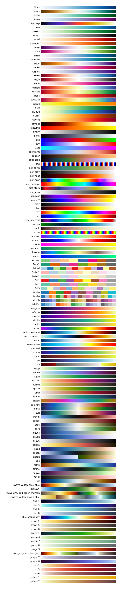

.. _config_colormaps:

Colormaps
==========

Each analysis task that includes plots with colormaps has a series of
configuration options that can be used to manipulate the colormap.
MPAS-Analysis supports two types of plots, each of which has an associated
set of options for configuring its colormap.

Supported Colormaps
--------------------

MPAS-Analysis supports all `matplotlib colormaps`_, all `cmocean colormaps`_,
all `Scientific Colour Map Suite 3.0`_ colormaps, the selection of key
`SciVisColor colormaps`_ and five custom color maps: ``ferret``,
``erdc_iceFire_H``, ``erdc_iceFire_L``, ``BuOr`` and ``Maximenko``.

   All available colormaps

To plot all availabe colormpas (as above), run::

    mpas_analysis --plot_colormaps

Indexed Colormaps
------------------

Indexed colormaps are used in association with contour plots in MPAS-Analysis.
The following configuration options are associated with an indexed colormap::

  # colormap name
  colormapName = RdYlBu_r
  # color indices into colormapName for filled contours
  colormapIndices = [0, 40, 80, 110, 140, 170, 200, 230, 255]
  # colormap levels/values for contour boundaries
  colorbarLevels = [-2, 0, 2, 6, 10, 16, 22, 26, 28, 32]

The indices are between 0 and 255, indicating the location within the colormap
to sample.  The levels are the contour values to plot.  Since the region
between two contours will be filled with a solid color specified by a colormap
index, the number of levels is one greater than the number of indices.  The
exception is when a separate shading should be used for values that fall
outside the range of the contours, in which case the number of colormap indices
is one more than the number of levels values, and the first and last index
are used to specify the "under" and "over" color values.

Continuous Colormaps
---------------------

A continuous colormap is specified with a different set of options::

  # colormap for model/observations
  colormapName = erdc_iceFire_H
  # the type of norm used in the colormap
  normType = symLog
  # A dictionary with keywords for the norm
  normArgs = {'linthresh': 1., 'linscale': 0.5, 'vmin': -100.,
              'vmax': 100.}

MPAS Analysis supports three norms for the continuous color map, with an
associated dictionary of arguments.  These are:

  * `linear`_
  * `log`_
  * `symLog`_

See the associated documentaiton for the arguments to each norm.

Colormpas in Three Panel Plots
------------------------------

Many MPAS-Analysis tasks include a panel for the main model run, another for
observations or a control run and a third panel for displaying a bias or the
the model-reference difference.  In such cases, we support one colormap for the
first two panels and another for the final panel.  Options for each of these
colormaps are specified by appending either ``Result`` or ``Difference`` to
each.  For example::

  # colormap for model/observations
  colormapNameResult = RdYlBu_r
  # color indices into colormapName for filled contours
  colormapIndicesResult = [0, 40, 80, 110, 140, 170, 200, 230, 255]
  # colormap levels/values for contour boundaries
  colorbarLevelsResult = [-2, 0, 2, 6, 10, 16, 22, 26, 28, 32]

  # colormap for differences
  colormapNameDifference = RdBu_r
  # color indices into colormapName for filled contours
  colormapIndicesDifference = [0, 28, 57, 85, 113, 128, 128, 142, 170, 198,
                               227, 255]
  # colormap levels/values for contour boundaries
  colorbarLevelsDifference = [-5, -3, -2, -1, -0.1, 0, 0.1, 1, 2, 3, 5]

Adding Contour Lines
--------------------

Contour lines can be added to a plot with the following options::

  # contour line levels
  contourLevels = numpy.arange(-240., 130., 10.)
  # contour line thickness
  contourThickness = 0.25
  # contour color
  contourColor = 0.25

The levels are the field values for each contour.  The line thickness is
specified in points.  The ``contourColor`` can be any color name supported
by ``matplotlib`` or a floating point number between 0 and 1 specifying a
shade of gray.

Append ``Result`` or ``Difference`` to these options for a 3-panel plot.

Specifying Colorbar Tick Marks
------------------------------

By default, colorbar tick marks are chosen automatically by ``matplotlib``.
To specify tick marks explicitly, use::

  colorbarTicks = [-100., -50., -20., -10., -5., -2., -1., 0., 1., 2., 5.,
                   10., 20., 50., 100.]

Alternatively, ``numpy`` functions can be used to specify the tick locations::

  colorbarTicks = numpy.linspace(-100, 100, 9)

Again, append ``Result`` or ``Difference`` to these options for a 3-panel plot.

.. _`matplotlib colormaps`: https://matplotlib.org/users/colormaps.html
.. _`cmocean colormaps`: https://matplotlib.org/cmocean/
.. _`Scientific Colour Map Suite 3.0`: http://www.fabiocrameri.ch/colourmaps.php
.. _`SciVisColor colormaps`: https://sciviscolor.org/home/colormaps/
.. _`linear`: https://matplotlib.org/users/colormapnorms.html
.. _`log`: https://matplotlib.org/users/colormapnorms.html#logarithmic
.. _`symLog`: https://matplotlib.org/users/colormapnorms.html#symmetric-logarithmic

