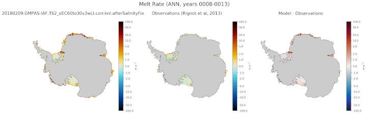

.. _task_climatologyMapAntarcticMelt:

climatologyMapAntarcticMelt
===========================

An analysis task for comparison of Antarctic maps of melt rates against
observations from `Paolo et al. (2023) <https://doi.org/10.5194/tc-17-3409-2023>`_.

Component and Tags::

  component: ocean
  tags: climatology, horizontalMap, meltRate, landIceCavities

Configuration Options
---------------------

The following configuration options are available for this task:

.. code-block:: cfg

    [climatologyMapAntarcticMelt]
    ## options related to plotting horizontally regridded maps of Antarctic
    ## sub-ice-shelf melt rates against control model results and observations

    # comparison grid(s)
    # only the Antarctic really makes sense but lat-lon could technically work.
    comparisonGrids = ['antarctic']

    # Months or seasons to plot (Jan, Feb, Mar, Apr, May, Jun, Jul, Aug, Sep, Oct,
    # Nov, Dec, JFM, AMJ, JAS, OND, ANN)
    seasons =  ['JFM', 'JAS', 'ANN']

    # colormap for model/observations
    colormapNameResult = erdc_iceFire_H
    # whether the colormap is indexed or continuous
    colormapTypeResult = continuous
    # the type of norm used in the colormap
    normTypeResult = symLog
    # A dictionary with keywords for the norm
    normArgsResult = {'linthresh': 1., 'linscale': 0.5, 'vmin': -100.,
                      'vmax': 100.}
    colorbarTicksResult = [-100., -50., -20., -10., -5., -2., -1., 0., 1., 2., 5.,
                           10., 20., 50., 100.]

    # colormap for differences
    colormapNameDifference = balance
    # whether the colormap is indexed or continuous
    colormapTypeDifference = continuous
    # the type of norm used in the colormap
    normTypeDifference = symLog
    # A dictionary with keywords for the norm
    normArgsDifference = {'linthresh': 1., 'linscale': 0.5, 'vmin': -100.,
                          'vmax': 100.}
    colorbarTicksDifference = [-100., -50., -20., -10., -5., -2., -1., 0., 1., 2.,
                               5., 10., 20., 50., 100.]

    # make a tables of mean melt rates and melt fluxes for individual ice shelves?
    makeTables = False

    # If making tables, which ice shelves?  This is a list of ice shelves or
    # ['all'] for all 106 ice shelves and regions.
    iceShelvesInTable = []

The option ``meltTables`` determines if tables of mean melt rates, averaged
over each ice shelf or region, are computed.  ``iceShelvesInTable`` is a list
of the ice shelf or region names to include in the table.  A value of ``'all'``
indicates that all 106 ice shelves and regions will be included in the table.
The table is in ``csv`` format and can be found in the ``tables`` subdirectory.

For more details, see:
 * :ref:`config_colormaps`
 * :ref:`config_seasons`
 * :ref:`config_comparison_grids`

Observations
------------

:ref:`paolo_melt`

Example Result
--------------

