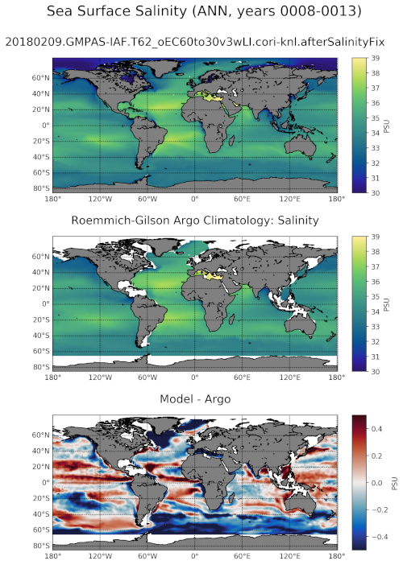

.. _task_climatologyMapArgoSalinity:

climatologyMapArgoSalinity
=============================

An analysis task for comparing salinity at various depths against
Argo observations.

Component and Tags::

  component: ocean
  tags: climatology, horizontalMap, argo, salinity, publicObs

Configuration Options
---------------------

The following configuration options are available for this task::

  [climatologyMapArgoSalinity]
  ## options related to plotting climatology maps of Global
  ## salinity at various levels against
  ## reference model results and the Roemmich-Gilson Argo Climatology

  # comparison grid(s)
  comparisonGrids = ['latlon']

  # Months or seasons to plot (Jan, Feb, Mar, Apr, May, Jun, Jul, Aug, Sep, Oct,
  # Nov, Dec, JFM, AMJ, JAS, OND, ANN)
  seasons =  ['ANN','JFM','JAS']

  # list of depths in meters (positive up) at which to analyze, 'top' for the
  # sea surface.  Argo data is only available above -2000 m
  depths = ['top', -25, -50, -100, -150, -200, -400, -600, -800, -1500]

  # colormap for model/observations
  colormapNameResult = haline
  # the type of norm used in the colormap
  normTypeResult = linear
  # A dictionary with keywords for the norm
  normArgsResult = {'vmin': 30, 'vmax': 39.0}
  # place the ticks automatically by default
  # colorbarTicksResult = numpy.linspace(34.2, 35.2, 9)

  # colormap for differences
  colormapNameDifference = balance
  # the type of norm used in the colormap
  normTypeDifference = linear
  # A dictionary with keywords for the norm
  normArgsDifference = {'vmin': -0.5, 'vmax': 0.5}
  # place the ticks automatically by default
  # colorbarTicksDifference = numpy.linspace(-0.5, 0.5, 9)

For more details, see:
 * :ref:`config_colormaps`
 * :ref:`config_seasons`
 * :ref:`config_comparison_grids`

The option ``depths`` is a list of (approximate) depths at which to sample
the salinity field.  A value of ``'top'`` indicates the sea
surface (or the ice-ocean interface under ice shelves) while a value of
``'bot'`` indicates the seafloor.

Observations
------------

:ref:`roemmich_gilson_argo`

Example Result
--------------

