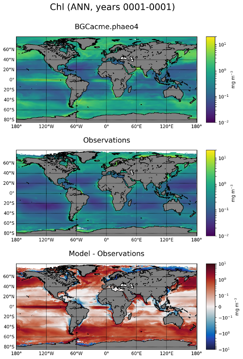

.. _task_climatologyMapBGC:

climatologyMapBGC
=================

An analysis task for comparison of global maps of biogeochemistry (BGC) fields
against observations.

Component and Tags::

  component: ocean
  tags: climatology, horizontalMap, BGC, PO4, NO3, SiO3, CO2_gas_flux, pH_3D,
        DIC, ALK, O2, pCO2surface, Chl

Configuration Options
---------------------

The following configuration options are available for this task::

  [climatologyMapBGC]
  ## options related to plotting climatology mpas of BGC

  # Variables to plot:
  # pH : 'pH_3D'
  # DIC : 'DIC'
  # ALK : 'ALK'
  # PO4 : 'PO4'
  # NO3 : 'NO3'
  # SiO3 : 'SiO3'
  # CO2 flux : 'CO2_gas_flux'
  # O2 : 'O2'
  variables = ['PO4', 'NO3', 'SiO3', 'CO2_gas_flux', 'pH_3D', 'DIC', 'ALK',
               'O2', 'pCO2surface', 'Chl']

  # Times for comparison times (Jan, Feb, Mar, Apr, May, Jun, Jul, Aug, Sep,
  # Oct, Nov, Dec, JFM, AMJ, JAS, OND, ANN)
  seasons = ['ANN', 'JFM', 'JAS']

  # comparison grid(s) ('latlon', 'antarctic') on which to plot analysis
  comparisonGrids = ['latlon', 'antarctic']

  # Whether to compare to preindustrial observations that are available.
  preindustrial = False

  [climatologyMapBGC_PO4]
  # Colormap for climatology
  colormapNameResult = dense
  # Colormap for clim - obs difference
  colormapNameDifference = balance
  # linear vs. log scaling for climatology
  normTypeResult = linear
  # Colorbar bounds for climatology
  normArgsResult = {'vmin': 0, 'vmax': 2.5}
  # linear vs. log scaling for obs
  normTypeDifference = linear
  # Colorbar bounds for obs
  normArgsDifference = {'vmin': -1, 'vmax': 1}
  # BGC property units
  units = mmol m$^{-3}$
  # Prefix to variable name in MPAS-O output
  filePrefix = timeMonthly_avg_ecosysTracers_
  # Acronym/label for observational dataset
  observationsLabel = WOA
  # Acronym/label for gallery variable (can be different from MPAS name)
  galleryLabel = PO4

  [climatologyMapBGC_NO3]
  colormapNameResult = dense
  colormapNameDifference = balance
  normTypeResult = linear
  normArgsResult = {'vmin': 0, 'vmax': 35.0}
  normTypeDifference = linear
  normArgsDifference = {'vmin': -10, 'vmax': 10}
  units = mmol m$^{-3}$
  filePrefix = timeMonthly_avg_ecosysTracers_
  observationsLabel = WOA
  galleryLabel = NO3

  [climatologyMapBGC_SiO3]
  colormapNameResult = dense
  colormapNameDifference = balance
  normTypeResult = linear
  normArgsResult = {'vmin': 0, 'vmax': 80}
  normTypeDifference = linear
  normArgsDifference = {'vmin': -20, 'vmax': 20}
  units = mmol m$^{-3}$
  filePrefix = timeMonthly_avg_ecosysTracers_
  observationsLabel = WOA
  galleryLabel = SiO3

  [climatologyMapBGC_CO2_gas_flux]
  colormapNameResult = BrBG_r
  colormapNameDifference = balance
  normTypeResult = linear
  normArgsResult = {'vmin': -5, 'vmax': 5}
  normTypeDifference = linear
  normArgsDifference = {'vmin': -5, 'vmax': 5}
  units = mol m$^{-2}$ yr$^{-1}$
  filePrefix = timeMonthly_avg_
  observationsLabel = SOM-FFNv2016
  galleryLabel = CO2 Flux

  [climatologyMapBGC_O2]
  colormapNameResult = matter
  colormapNameDifference = balance
  normTypeResult = linear
  normArgsResult = {'vmin': 2, 'vmax': 8}
  normTypeDifference = linear
  normArgsDifference = {'vmin': -2, 'vmax': 2}
  units = mL/L
  filePrefix = timeMonthly_avg_ecosysTracers_
  observationsLabel = WOA
  galleryLabel = O2

  [climatologyMapBGC_pH_3D]
  colormapNameResult = PuBuGn_r
  colormapNameDifference = balance
  normTypeResult = linear
  normArgsResult = {'vmin': 8, 'vmax': 8.2}
  normTypeDifference = linear
  normArgsDifference = {'vmin': -0.2, 'vmax': 0.2}
  units =
  filePrefix = timeMonthly_avg_ecosys_diag_
  observationsLabel = GLODAPv2
  galleryLabel = pH

  [climatologyMapBGC_DIC]
  colormapNameResult = YlGnBu
  colormapNameDifference = balance
  normTypeResult = linear
  normArgsResult = {'vmin': 1900, 'vmax': 2300}
  normTypeDifference = linear
  normArgsDifference = {'vmin': -100, 'vmax': 100}
  units = mmol m$^{-3}$
  filePrefix = timeMonthly_avg_ecosysTracers_
  observationsLabel = GLODAPv2
  galleryLabel = DIC

  [climatologyMapBGC_ALK]
  colormapNameResult = PuBuGn
  colormapNameDifference = balance
  normTypeResult = linear
  normArgsResult = {'vmin': 2150, 'vmax': 2450}
  normTypeDifference = linear
  normArgsDifference = {'vmin': -100, 'vmax': 100}
  units = meq m$^{-3}$
  filePrefix = timeMonthly_avg_ecosysTracers_
  observationsLabel = GLODAPv2
  galleryLabel = Alkalinity

  [climatologyMapBGC_pCO2surface]
  colormapNameResult = viridis
  colormapNameDifference = balance
  normTypeResult = linear
  normArgsResult = {'vmin': 300, 'vmax': 450}
  normTypeDifference = linear
  normArgsDifference = {'vmin': -50, 'vmax': 50}
  units = $\mu$atm
  filePrefix = timeMonthly_avg_ecosys_diag_
  observationsLabel = SOM-FFNv2016
  galleryLabel = pCO2

  [climatologyMapBGC_Chl]
  colormapNameResult = viridis
  colormapNameDifference = balance
  normTypeResult = log
  normArgsResult = {'vmin': 0.01, 'vmax': 20}
  normTypeDifference = symLog
  normArgsDifference = {'linthresh': 0.1, 'vmin': -10, 'vmax': 10}
  units = mg m$^{-3}$
  filePrefix = timeMonthly_avg_ecosysTracers_
  observationsLabel = SeaWIFS
  galleryLabel = Chlorophyll

For more details, see:
 * :ref:`config_colormaps`
 * :ref:`config_seasons`
 * :ref:`config_comparison_grids`

Observations
------------

 * :ref:`woa`
 * :ref:`roemmich_gilson_argo`
 * :ref:`seawifs`
 * :ref:`glodapv2`

Example Result
--------------

