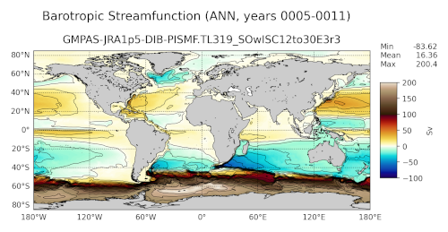

.. _task_climatologyMapBSF:

climatologyMapBSF
=================

An analysis task for comparison of maps of barotropic streamfunction (BSF).

Component and Tags::

  component: ocean
  tags: climatology, horizontalMap, barotropicStreamfunction, publicObs, streamfunction

Configuration Options
---------------------

The following configuration options are available for this task::

  [climatologyMapBSF]
  ## options related to plotting horizontally remapped climatologies of
  ## the barotropic streamfunction (BSF) against control model results
  ## (if available)

  # colormap for model/observations
  colormapNameResult = blue-orange-div
  # whether the colormap is indexed or continuous
  colormapTypeResult = continuous
  # color indices into colormapName for filled contours
  # the type of norm used in the colormap
  normTypeResult = symLog
  # A dictionary with keywords for the norm
  normArgsResult = {'linthresh': 30., 'linscale': 0.5, 'vmin': -100., 'vmax': 100.}
  colorbarTicksResult = [-100.,-40., -20., -10., 0., 10., 20., 40., 100.]
  # Adding contour lines to the figure
  contourLevelsResult = np.arange(-100., 101.0, 10.)
  contourThicknessResult = 0.5
  contourColorResult = black
  # Add arrows to contour lines
  # whether to include arrows on the contour lines showing the direction of flow
  arrowsOnContourResult = True
  # colormap for differences
  colormapNameDifference = cmo.balance
  # whether the colormap is indexed or continuous
  colormapTypeDifference = continuous
  # the type of norm used in the colormap
  normTypeDifference = linear
  # A dictionary with keywords for the norm
  normArgsDifference = {'vmin': -10., 'vmax': 10.}
  # colorbarTicksDifference = numpy.linspace(-10., 10., 9)

  # Months or seasons to plot (Jan, Feb, Mar, Apr, May, Jun, Jul, Aug, Sep, Oct,
  # Nov, Dec, JFM, AMJ, JAS, OND, ANN)
  seasons =  ['ANN']

  # comparison grid(s) on which to plot analysis
  comparisonGrids = ['latlon', 'subpolar_north_atlantic']

  # list of tuples(pairs) of depths (min, max) to integrate horizontal transport over
  depthRanges = [(0.0, -10000.0), (0.0, -2000.0)]

  # minimum latitude (degrees) above which the mean BSF on boundary vertices
  # averages to zero
  minLatitudeForZeroBSF = -45.0

By default, the BSF is computed over two depth ranges---the full depth of
the ocean and only to 2000 m.  By default, global and subpolar North Atlantic
plots are produced.  The BSF is constrained to have a mean value on coastal
boundaries of zero north of ``minLatitudeForZeroBSF``.

For more details, see:
 * :ref:`config_colormaps`
 * :ref:`config_seasons`
 * :ref:`config_comparison_grids`

Example Result
--------------

