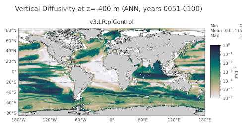

.. _task_climatologyMapCustom:

climatologyMapCustom
====================

An analysis task for plotting custom climatologies at various depths. This task
can plot both 2D and 3D variables on cells, the latter with both
``nVertlevels`` -- layer centers -- or ``nVertLevelsP1`` -- layer interfaces
-- as the vertical dimension.  The task is designed to be highly coustomizable
via config sections and options, as described below.

Component and Tags::

  component: ocean
  tags: climatology, horizontalMap

Configuration Options
---------------------

The following configuration options are available for this task::

    [climatologyMapCustom]
    ## options related to plotting climatology maps of any field at various depths
    ## (if they include a depth dimension) without observatons for comparison

    # comparison grid(s)
    comparisonGrids = ['latlon']

    # Months or seasons to plot (Jan, Feb, Mar, Apr, May, Jun, Jul, Aug, Sep, Oct,
    # Nov, Dec, JFM, AMJ, JAS, OND, ANN)
    seasons =  ['ANN']

    # list of depths in meters (positive up) at which to analyze, 'top' for the
    # sea surface, 'bot' for the sea floor
    depths = ['top', -200, -400, -600, -800, -1000, -1500, -2000, 'bot']

    # a list of variables available to plot. New variables can be added as long
    # as they correspond to a single field already found in MPAS-Ocean's
    # timeSeriesStatsMonthly output. Add the 'name', 'title', 'units' (with $$
    # instead a single dollar sign for the config parser), and 'mpas'(the
    # timeSeriesStatsMonthly variable name as a single-item list) entries for each
    # variable. Then, add a section below climatologyMapCustom<VariableName> with
    # the colormap settings for that variable.
    availableVariables = {
        'temperature':
            {'title': 'Potential Temperature',
            'units': r'$$^\circ$$C',
            'mpas': ['timeMonthly_avg_activeTracers_temperature']},
        'salinity':
            {'title': 'Salinity',
            'units': 'PSU',
            'mpas': ['timeMonthly_avg_activeTracers_salinity']},
        'potentialDensity':
            {'title': 'Potential Density',
            'units': 'kg m$$^{-3}$$',
            'mpas': ['timeMonthly_avg_potentialDensity']},
        'thermalForcing':
            {'title': 'Thermal Forcing',
            'units': r'$$^\circ$$C',
            'mpas': ['timeMonthly_avg_activeTracers_temperature',
                    'timeMonthly_avg_activeTracers_salinity',
                    'timeMonthly_avg_density',
                    'timeMonthly_avg_activeTracers_layerThickness']},
        'zonalVelocity':
            {'title': 'Zonal Velocity',
            'units': r'm s$$^{-1}$$',
            'mpas': ['timeMonthly_avg_velocityZonal']},
        'meridionalVelocity':
            {'title': 'Meridional Velocity',
            'units': r'm s$$^{-1}$$',
            'mpas': ['timeMonthly_avg_velocityMeridional']},
        'velocityMagnitude':
            {'title': 'Zonal Velocity',
            'units': r'm s$$^{-1}$$',
            'mpas': ['timeMonthly_avg_velocityZonal',
                    'timeMonthly_avg_velocityMeridional']},
        'vertVelocity':
            {'title': 'Vertical Velocity',
            'units': r'm s$$^{-1}$$',
            'mpas': ['timeMonthly_avg_vertVelocityTop']},
        'vertDiff':
            {'title': 'Vertical Diffusivity',
            'units': r'm s$$^{-1}$$',
            'mpas': ['timeMonthly_avg_vertDiffTopOfCell']},
        'vertVisc':
            {'title': 'Vertical Viscosity',
            'units': r'm s$$^{-1}$$',
            'mpas': ['timeMonthly_avg_vertViscTopOfCell']},
        'mixedLayerDepth':
            {'title': 'Mixed Layer Depth',
            'units': 'm',
            'mpas': ['timeMonthly_avg_dThreshMLD']},
        }

    # a list of fields top plot for each transect.  All supported fields are listed
    # below
    variables = []

    [climatologyMapCustomTemperature]
    ## options related to plotting climatology maps of potential temperature at
    ## various levels, including the sea surface and sea floor, possibly against
    ### control model results

    # colormap for model/observations
    colormapNameResult = RdYlBu_r
    # whether the colormap is indexed or continuous
    colormapTypeResult = continuous
    # the type of norm used in the colormap
    normTypeResult = linear
    # A dictionary with keywords for the norm
    normArgsResult = {'vmin': -2., 'vmax': 10.}
    # place the ticks automatically by default
    # colorbarTicksResult = numpy.linspace(-2., 10., 9)

    # colormap for differences
    colormapNameDifference = balance
    # whether the colormap is indexed or continuous
    colormapTypeDifference = continuous
    # the type of norm used in the colormap
    normTypeDifference = linear
    # A dictionary with keywords for the norm
    normArgsDifference = {'vmin': -5., 'vmax': 5.}
    # place the ticks automatically by default
    # colorbarTicksDifference = numpy.linspace(-5., 5., 9)

    [climatologyMapCustomSalinity]
    colormapNameResult = haline
    colormapTypeResult = continuous
    normTypeResult = linear
    normArgsResult = {'vmin': 32.2, 'vmax': 35.5}
    colormapNameDifference = balance
    colormapTypeDifference = continuous
    normTypeDifference = linear
    normArgsDifference = {'vmin': -1.5, 'vmax': 1.5}

    [climatologyMapCustomPotentialDensity]
    colormapNameResult = Spectral_r
    colormapTypeResult = continuous
    normTypeResult = linear
    normArgsResult = {'vmin': 1026.5, 'vmax': 1028.}
    colormapNameDifference = balance
    colormapTypeDifference = continuous
    normTypeDifference = linear
    normArgsDifference = {'vmin': -0.3, 'vmax': 0.3}

    [climatologyMapCustomThermalForcing]
    colormapNameResult = thermal
    colormapTypeResult = continuous
    normTypeResult = linear
    normArgsResult = {'vmin': -1., 'vmax': 5.}
    colormapNameDifference = balance
    colormapTypeDifference = continuous
    normTypeDifference = linear
    normArgsDifference = {'vmin': -3., 'vmax': 3.}

    [climatologyMapCustomZonalVelocity]
    colormapNameResult = delta
    colormapTypeResult = continuous
    normTypeResult = linear
    normArgsResult = {'vmin': -0.2, 'vmax': 0.2}
    colormapNameDifference = balance
    colormapTypeDifference = continuous
    normTypeDifference = linear
    normArgsDifference = {'vmin': -0.2, 'vmax': 0.2}

    [climatologyMapCustomMeridionalVelocity]
    colormapNameResult = delta
    colormapTypeResult = continuous
    normTypeResult = linear
    normArgsResult = {'vmin': -0.2, 'vmax': 0.2}
    colormapNameDifference = balance
    colormapTypeDifference = continuous
    normTypeDifference = linear
    normArgsDifference = {'vmin': -0.2, 'vmax': 0.2}

    [climatologyMapCustomVelocityMagnitude]
    colormapNameResult = ice
    colormapTypeResult = continuous
    normTypeResult = log
    normArgsResult = {'vmin': 1.e-3, 'vmax': 1.}
    colormapNameDifference = balance
    colormapTypeDifference = continuous
    normTypeDifference = linear
    normArgsDifference = {'vmin': -0.2, 'vmax': 0.2}

    [climatologyMapCustomVertVelocity]
    colormapNameResult = delta
    colormapTypeResult = continuous
    normTypeResult = linear
    normArgsResult = {'vmin': -1e-5, 'vmax': 1e-5}
    colormapNameDifference = balance
    colormapTypeDifference = continuous
    normTypeDifference = linear
    normArgsDifference = {'vmin': -1e-5, 'vmax': 1e-5}

    [climatologyMapCustomVertDiff]
    colormapNameResult = rain
    colormapTypeResult = continuous
    normTypeResult = log
    normArgsResult = {'vmin': 1e-6, 'vmax': 1.}
    colormapNameDifference = balance
    colormapTypeDifference = continuous
    normTypeDifference = linear
    normArgsDifference = {'vmin': -0.5, 'vmax': 0.5}

    [climatologyMapCustomVertVisc]
    colormapNameResult = rain
    colormapTypeResult = continuous
    normTypeResult = log
    normArgsResult = {'vmin': 1e-6, 'vmax': 1.}
    colormapNameDifference = balance
    colormapTypeDifference = continuous
    normTypeDifference = linear
    normArgsDifference = {'vmin': -0.5, 'vmax': 0.5}

    [climatologyMapCustomMixedLayerDepth]
    colormapNameResult = viridis
    colormapTypeResult = continuous
    normTypeResult = log
    normArgsResult = {'vmin': 10., 'vmax': 300.}
    colorbarTicksResult = [10, 20, 40, 60, 80, 100, 200, 300]
    colormapNameDifference = balance
    colormapTypeDifference = continuous
    normTypeDifference = symLog
    normArgsDifference = {'linthresh': 10., 'linscale': 0.5, 'vmin': -200.,
                        'vmax': 200.}
    colorbarTicksDifference = [-200., -100., -50., -20., -10., 0., 10., 20., 50., 100., 200.]

There is a section for options that apply to all custom climatology maps and
one each for any available variables to plot.

The option ``availableVariables`` is a dictionary with the names of the
variables available to plot as keys and dictionaries with the title, units,
and MPAS variable name(s) as values.  New entries can be added as long as they
correspond to a single field already found in MPAS-Ocean's
``timeSeriesStatsMonthly`` output.  For each variable, a section with the name
``climatologyMapCustom<VariableName>`` should be added with the colormap
settings for that variable, see :ref:`config_colormaps` for details.

The option ``depths`` is a list of (approximate) depths at which to sample
the potential temperature field.  A value of ``'top'`` indicates the sea
surface (or the ice-ocean interface under ice shelves) while a value of
``'bot'`` indicates the seafloor.

By default, no fields are plotted.  A user can select which fields to plot by
adding the desired field names to the ``variables`` list.

For more details, see:
 * :ref:`config_colormaps`
 * :ref:`config_seasons`
 * :ref:`config_comparison_grids`

Example Result
--------------

