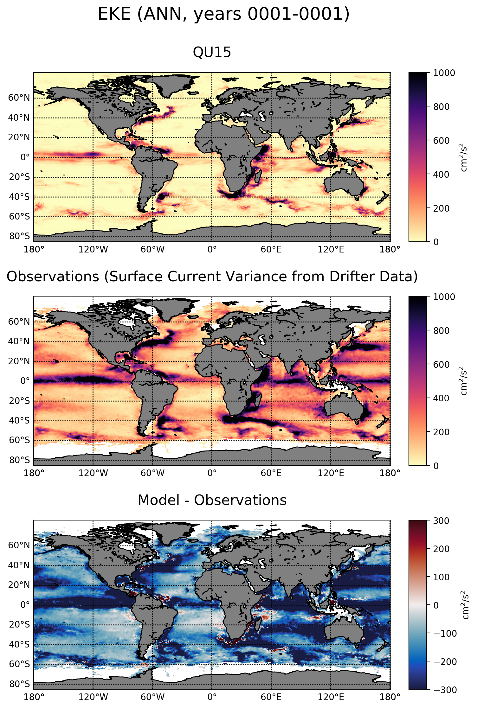

.. _task_climatologyMapEKE:

climatologyMapEKE
=================

An analysis task for comparison of global maps of sea surface height (SSH)
with zero mean against observations.  The mean has been subtracted because the
initial sea level is somewhat arbitrary and will lead to a systematic offset
when compared with the observations.

Component and Tags::

  component: ocean
  tags: climatology, horizontalMap, eke, publicObs

Configuration Options
---------------------

The following configuration options are available for this task::

  [climatologyMapEKE]
  ## options related to plotting horizontally remapped climatologies of
  ## eddy kinetic energy (EKE) against reference model results and observations

  # colormap for model/observations
  colormapNameResult = magma_r
  # the type of norm used in the colormap
  normTypeResult = linear
  # A dictionary with keywords for the norm
  normArgsResult = {'vmin': 0., 'vmax': 1000.}
  # place the ticks automatically by default
  # colorbarTicksResult = numpy.linspace(-2., 2., 9)

  # colormap for differences
  colormapNameDifference = balance
  # the type of norm used in the colormap
  normTypeDifference = linear
  # A dictionary with keywords for the norm
  normArgsDifference = {'vmin': -300., 'vmax': 300.}
  # place the ticks automatically by default
  # colorbarTicksDifference = numpy.linspace(-2., 2., 9

  # Months or seasons to plot (Jan, Feb, Mar, Apr, May, Jun, Jul, Aug, Sep, Oct,
  # Nov, Dec, JFM, AMJ, JAS, OND, ANN)
  seasons =  ['ANN']

  # comparison grid(s) ('latlon', 'antarctic') on which to plot analysis
  comparisonGrids = ['latlon']

For more details, see:
 * :ref:`config_colormaps`
 * :ref:`config_seasons`
 * :ref:`config_comparison_grids`

Observations
------------

:ref:`drifter_eke`

Example Result
--------------

