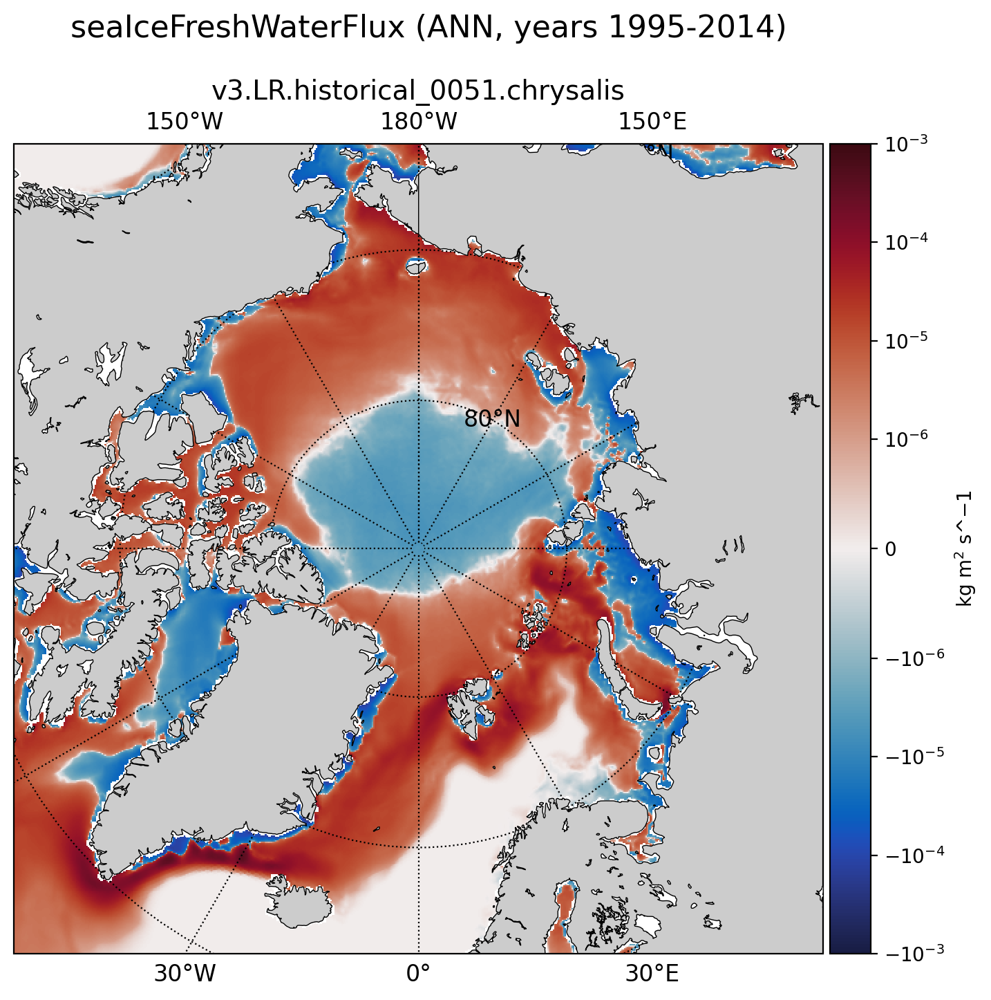

.. _task_climatologyMapFluxes:

climatologyMapFluxes
====================

An analysis task for comparison of global maps of surface mass fluxes.
No observational products are currently available.

Component and Tags::

  component: ocean
  tags: climatology, horizontalMap, fluxes

Configuration Options
---------------------

The following configuration options are available for this task::

  [climatologyMapFluxes]
  
  # colormap for model
  colormapNameResult = balance
  # whether the colormap is indexed or continuous
  colormapTypeResult = continuous
  # color indices into colormapName for filled contours
  colormapIndicesResult = [0, 40, 80, 110, 140, 170, 200, 230, 255]
  # colormap levels/values for contour boundaries
  colorbarLevelsResult = [-2, 0, 2, 6, 10, 16, 22, 26, 28, 32]
  # the type of norm used in the colormap
  normTypeResult = symLog
  # A dictionary with keywords for the norm
  normArgsResult = {'vmin': -1e-3, 'vmax': 1e-3, 'linthresh': 1e-6}
  
  # colormap for differences
  colormapNameDifference = balance
  # whether the colormap is indexed or continuous
  colormapTypeDifference = continuous
  # color indices into colormapName for filled contours
  colormapIndicesDifference = [0, 28, 57, 85, 113, 128, 128, 142, 170, 198, 227, 255]
  # colormap levels/values for contour boundaries
  colorbarLevelsDifference = [-5, -3, -2, -1, -0.1, 0, 0.1, 1, 2, 3, 5]
  # the type of norm used in the colormap
  normTypeDifference = symLog
  # A dictionary with keywords for the norm
  normArgsDifference = {'vmin': -1e-3, 'vmax': 1e-3, 'linthresh': 1e-6}
  
  variables = ['riverRunoffFlux', 'iceRunoffFlux', 'snowFlux', 'rainFlux', 'evaporationFlux', 'seaIceFreshWaterFlux', 'landIceFreshwaterFlux']
  seasons =  ['JFM', 'JAS', 'ANN']
  # comparison grid(s) on which to plot analysis
  comparisonGrids = ['latlon', 'arctic', 'antarctic']
  
  # first and last year of SST observational climatology (preferably one of the
  # two ranges given below)
  # values for preindustrial
  obsStartYear = 1870
  obsEndYear = 1900

By default, a "preindustrial" climatology is computed for comparison with the
model results.  For simulations covering a different time period, the range of
years (``obsStartYear`` and ``obsEndYear``) should be updated.

For details on the remaining configuration options, see:
 * :ref:`config_colormaps`
 * :ref:`config_seasons`
 * :ref:`config_comparison_grids`

Observations
------------

None available.

Example Result
--------------

