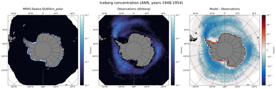

.. _task_climatologyMapIcebergConcSH:

climatologyMapIcebergConcSH
===========================

An analysis task for plotting maps of Antarctic iceberg concentration against
observations.

Component and Tags::

  component: seaIce
  tags: icebergs, climatology, horizontalMap

Configuration Options
---------------------

The following configuration options are available for this task::

  [climatologyMapIcebergConcSH]
  ## options related to plotting horizontally remapped climatologies of
  ## iceberg concentration against reference model results and observations
  ## in the southern hemisphere (SH)

  # colormap for model/observations
  colormapNameResult = ice
  # the type of norm used in the colormap
  normTypeResult = log
  # A dictionary with keywords for the norm
  normArgsResult = {'vmin': 1e-5, 'vmax': 1e-2}
  # specify the ticks
  colorbarTicksResult = [1e-5, 1e-4, 1e-3, 1e-2]

  # colormap for differences
  colormapNameDifference = balance
  # the type of norm used in the colormap
  normTypeDifference = symLog
  # A dictionary with keywords for the norm
  normArgsDifference = {'linthresh': 1e-5, 'linscale': 1, 'vmin': -1e-2, 'vmax': 1e-2}

  # Months or seasons to plot (These should be left unchanged, since
  # observations are only available for these seasons)
  seasons =  ['ANN', DJF', 'JJA']

  # comparison grid(s) ('latlon', 'antarctic') on which to plot analysis
  comparisonGrids = ['latlon']

  # reference lat/lon for iceberg plots in the southern hemisphere
  minimumLatitude = -50
  referenceLongitude = 180

  # a list of prefixes describing the sources of the observations to be used
  observationPrefixes = ['Altiberg']

  # arrange subplots vertically?
  vertical = False

  # observations files
  concentrationAltibergSH = Altiberg/Altiberg_1991-2017_20180308.nc

The option ``minimumLatitude`` determines what the northernmost latitude (in
degrees) included in the plot will be.  The option ``referenceLongitude``
defines which longitude will be at the bottom of the plot.

The option ``vertical = True`` can be used to plot 3 panels one above another
(resulting in a tall, thin image) rather than next to each other, the default
(resulting in a short, wide image).

For details on the remaining configration options, see:
 * :ref:`config_colormaps`
 * :ref:`config_seasons`
 * :ref:`config_comparison_grids`

Observations
------------
* :ref:`altiberg`

Example Result
--------------

