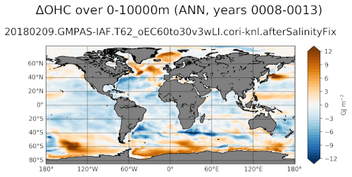

.. _task_climatologyMapOHCAnomaly:

climatologyMapOHCAnomaly
========================

An analysis task for plotting anomalies in ocean heat content (OHC) compared
with a reference year (typically the start of the simulation).

Component and Tags::

  component: ocean
  tags: climatology, horizontalMap, deltaOHC, publicObs

Configuration Options
---------------------

The following configuration options are available for this task::

  [climatologyMapOHCAnomaly]
  ## options related to plotting horizontally remapped climatologies of
  ## ocean heat content (OHC) against reference model results (if available)

  # colormap for model/observations
  colormapNameResult = BuOr
  # color indices into colormapName for filled contours
  colormapIndicesResult = numpy.array(numpy.linspace(0, 255, 38), int)
  # colormap levels/values for contour boundaries
  colorbarLevelsResult = numpy.linspace(-12., 12., 37)
  # colormap levels/values for ticks (defaults to same as levels)
  colorbarTicksResult = numpy.linspace(-12., 12., 9)

  # colormap for differences
  colormapNameDifference = balance
  # color indices into colormapName for filled contours
  colormapIndicesDifference = numpy.array(numpy.linspace(0, 255, 10), int)
  # colormap levels/values for contour boundaries
  colorbarLevelsDifference = numpy.linspace(-2., 2., 11)

  # Months or seasons to plot (Jan, Feb, Mar, Apr, May, Jun, Jul, Aug, Sep,
  # Oct, Nov, Dec, JFM, AMJ, JAS, OND, ANN)
  seasons =  ['ANN']

  # comparison grid(s) ('latlon', 'antarctic') on which to plot analysis
  comparisonGrids = ['latlon']

  # A list of pairs of minimum and maximum depths (positive up, in meters) to
  # include in the vertical sums.  The default values are the equivalents of the
  # default ranges of the timeSeriesOHCAnomaly task, with a value of -10,000 m
  # intended to be well below the bottom of the ocean for all existing MPAS-O
  # meshes.
  depthRanges = [(0.0, -10000.0), (0.0, -700.0), (-700.0, -2000.0),
                 (-2000.0, -10000.0)]

For more details, see:
 * :ref:`config_colormaps`
 * :ref:`config_seasons`
 * :ref:`config_comparison_grids`

The option ``depthRange`` is a list of upper and lower bounds in meters over
which to integrate the heat content.

Example Result
--------------

