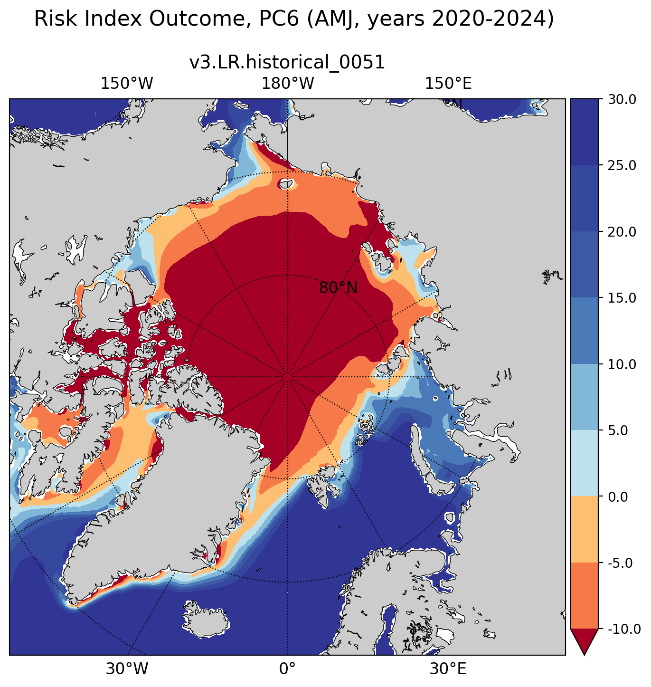

.. _task_climatologyMapRiskIndexOutcomeNH:

climatologyMapRiskIndexOutcomeNH
================================

An analysis task for plotting maps of Arctic risk index outcome (rio) for navigation in ice-covered waters.

Component and Tags::

  component: seaIce
  tags: climatology, horizontalMap, RiskIndexOutcome

Configuration Options
---------------------

The following configuration options are available for this task::

  [climatologyMapRiskIndexOutcomeNH]
  ## options related to plotting maps of the Risk Index Outcome (RIO) for navigability
  ## in sea-ice covered water from climatologies. The Risk Index Outcome is a navigability
  ## metric defined by the International Maritime Organization (IMO). The index ranges
  ## from -80 to 30. It depends on the sea-ice concentration and on Risk Index Values,
  ## which are assigned to a vessel according to its structural properties and according
  ## to ice thickness (and age). The maximum RIO refers to navigation in open water.
  ## Navigation under conditions of negative RIO values is restricted to some types
  ## of vessels. Navigation should generally be avoided where RIO < -10.

  # table of Risk Index Values (IMO, MSC.1/Circ.1519 6 June 2016)
  # https://www.imorules.com/GUID-2C1D86CB-5D58-490F-B4D4-46C057E1D102.html
  rivNH = RIV/riv_MSC.1_Circ.1519_6_June_2016.csv

  # colormap for model/observations
  colormapNameResult = RdYlBu
  # whether the colormap is indexed or continuous
  colormapTypeResult = indexed
  # color indices into colormapName for filled contours
  colormapIndicesResult = [0, 56, 85, 170, 198, 227, 241, 248, 255, 255]
  # colormap levels/values for contour boundaries
  colorbarLevelsResult = numpy.linspace(-10., 30., 9)

  # Months or seasons to plot (Jan, Feb, Mar, Apr, May, Jun, Jul, Aug, Sep, Oct,
  # Nov, Dec, JFM, AMJ, JAS, OND, ANN)
  seasons =  ['AMJ', 'OND']

  # comparison grid(s) on which to plot analysis
  comparisonGrids = ['arctic']

  # Polar Class of vessels, according to IMO, for which RIO maps will be generated.
  # Range is 1 to 12. Here the values 1-7 refer to the ‘Polar Classes’ PC1-PC7,
  # assigned by the International Association of Classification Societies (IACS).
  # A PC1 vessel is capable of year-round operations in all polar waters. PC2 and PC3
  # vessels can navigate in 2.5 m (or more) thick ice. The values 8-11 correspond
  # to the Finnish-Swedish ice classes 'IA Super', 'IA', 'IB' and 'IC'.
  # The last value, 12, refers to ‘Not-Ice-Strengthened’ ships, all vessels without
  # a Polar Class.
  polarClass = 6

  # reference floe thicknesses (m) for calculation of the Risk Index Value (RIV)
  # The thicknesses are intended to render the type of ice as defined by IMO.
  # There must be as many values as there are types of ice in the RIV table.
  # The first value has to be zero.
  h_to_typeofice = [0, 0.005, 0.1, 0.15, 0.3, 0.5, 0.7, 1, 1.2, 1.7, 2, 2.5]

  # whether to use sea-ice categories for sea-ice concentration and thickness
  useIceCategories = False

  # minimum lat and reference lon for sea ice plots in the northern hemisphere
  minimumLatitude = 50
  referenceLongitude = 0

  # arrange subplots vertically?
  vertical = False

The option ``vertical = True`` can be used to plot 3 panels one above another
(resulting in a tall, thin image) rather than next to each other, the default
(resulting in a short, wide image).

For details on the remaining configuration options, see:
 * :ref:`config_colormaps`
 * :ref:`config_seasons`
 * :ref:`config_comparison_grids`

Observations
------------
:ref:`imo_riv`

Example Result
--------------

