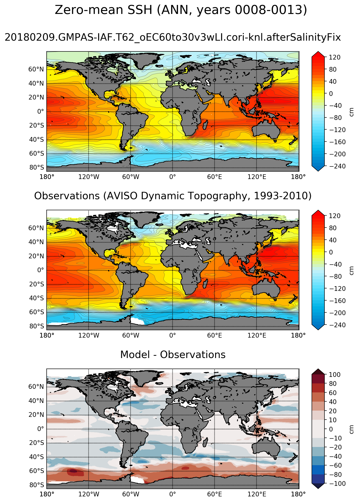

.. _task_climatologyMapSSH:

climatologyMapSSH
=================

An analysis task for comparison of global maps of sea surface height (SSH)
with zero mean against observations.  The mean has been subtracted because the
initial sea level is somewhat arbitrary and will lead to a systematic offset
when compared with the observations.

Component and Tags::

  component: ocean
  tags: climatology, horizontalMap, ssh, publicObs

Configuration Options
---------------------

The following configuration options are available for this task::

  [climatologyMapSSH]
  ## options related to plotting horizontally remapped climatologies of
  ## sea surface height (SSH) against reference model results and observations

  # colormap for model/observations
  colormapNameResult = Maximenko
  # color indices into colormapName for filled contours
  colormapIndicesResult = numpy.array(numpy.linspace(0, 255, 38), int)
  # colormap levels/values for contour boundaries
  colorbarLevelsResult = numpy.arange(-240., 130., 10.)
  # colormap levels/values for ticks (defaults to same as levels)
  colorbarTicksResult = numpy.arange(-240., 160., 40.)

  # contour line levels
  contourLevelsResult = numpy.arange(-240., 130., 10.)
  # contour line thickness
  contourThicknessResult = 0.25
  # contour color
  contourColorResult = 0.25

  # colormap for differences
  colormapNameDifference = balance
  # color indices into colormapName for filled contours
  colormapIndicesDifference = [0, 23, 46, 70, 93, 116, 128, 128, 139, 162, 185,
                               209, 232, 255]
  # colormap levels/values for contour boundaries
  colorbarLevelsDifference = [-100., -80., -60., -40., -20., -10., 0., 10.,
                              20.,  40.,  60.,  80.,  100.]

  # Months or seasons to plot (Jan, Feb, Mar, Apr, May, Jun, Jul, Aug, Sep, Oct,
  # Nov, Dec, JFM, AMJ, JAS, OND, ANN)
  seasons =  ['JFM', 'JAS', 'ANN']

  # comparison grid(s) ('latlon', 'antarctic') on which to plot analysis
  comparisonGrids = ['latlon']

For more details, see:
 * :ref:`config_colormaps`
 * :ref:`config_seasons`
 * :ref:`config_comparison_grids`

.. note::

   The color map and contours for these plots were inspired by Fig. 1 from
   `Maximenko et al. (2009)`_

Observations
------------

:ref:`aviso_ssh`

Example Result
--------------

.. _`Maximenko et al. (2009)`: http://journals.ametsoc.org/doi/abs/10.1175/2009JTECHO672.1