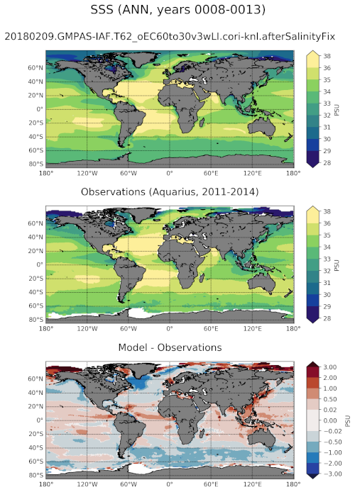

.. _task_climatologyMapSSS:

climatologyMapSSS
=================

An analysis task for comparison of global maps of sea surface salinity (SSS)
against observations.

Component and Tags::

  component: ocean
  tags: climatology, horizontalMap, sss, publicObs

Configuration Options
---------------------

The following configuration options are available for this task::

  [climatologyMapSSS]
  ## options related to plotting horizontally remapped climatologies of
  ## sea surface salinity (SSS) against reference model results and observations

  # colormap for model/observations
  colormapNameResult = haline
  # color indices into colormapName for filled contours
  colormapIndicesResult = [0, 40, 80, 110, 140, 170, 200, 230, 255]
  # colormap levels/values for contour boundaries
  colorbarLevelsResult = [28, 29, 30, 31, 32, 33, 34, 35, 36, 38]

  # colormap for differences
  colormapNameDifference = RdBu_r
  # color indices into colormapName for filled contours
  colormapIndicesDifference = [0, 28, 57, 85, 113, 128, 128, 142, 170, 198,
                               227, 255]
  # colormap levels/values for contour boundaries
  colorbarLevelsDifference = [-3, -2, -1, -0.5, -0.02, 0,  0.02, 0.5, 1, 2, 3]

  # Times for comparison times (Jan, Feb, Mar, Apr, May, Jun, Jul, Aug, Sep,
  # Oct, Nov, Dec, JFM, AMJ, JAS, OND, ANN)
  seasons =  ['JFM', 'JAS', 'ANN']

  # comparison grid(s) ('latlon', 'antarctic') on which to plot analysis
  comparisonGrids = ['latlon']

For more details, see:
 * :ref:`config_colormaps`
 * :ref:`config_seasons`
 * :ref:`config_comparison_grids`

Observations
------------

:ref:`aquarius_sss`

Example Result
--------------

