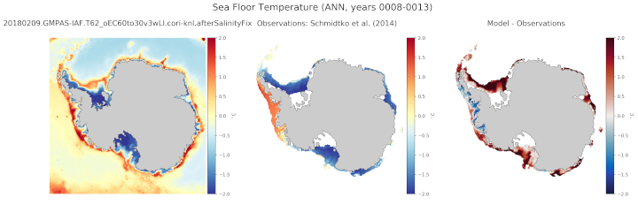

.. _task_climatologyMapSchmidtko:

climatologyMapSchmidtko
=======================

An analysis task for comparison of Antarctic maps of seafloor potential
temperature, salinity and potential density against observations from
`Schmidtko et al. (2014)`_.

Component and Tags::

  component: ocean
  tags: climatology, horizontalMap, temperature, salinity, potentialDensity

Configuration Options
---------------------

The following configuration options are available for this task::

  [climatologyMapSchmidtko]
  ## options related to plotting climatology maps of Antarctic fields at the
  ## seafloor and comparing them against data from Schmidtko et al. (2014)

  # comparison grid(s)
  # only the Antarctic really makes sense but lat-lon could technically work.
  comparisonGrids = ['antarctic']

  # Months or seasons to plot (Jan, Feb, Mar, Apr, May, Jun, Jul, Aug, Sep, Oct,
  # Nov, Dec, JFM, AMJ, JAS, OND, ANN)
  seasons =  ['ANN','JFM','JAS']

  [climatologyMapSchmidtkoTemperature]
  ## options related to plotting climatology maps of potential temperature at the
  ## seafloor and comparing them against data from Schmidtko et al. (2014)

  # colormap for model/observations
  colormapNameResult = RdYlBu_r
  # the type of norm used in the colormap
  normTypeResult = linear
  # A dictionary with keywords for the norm
  normArgsResult = {'vmin': -2., 'vmax': 2.}
  # place the ticks automatically by default
  # colorbarTicksResult = numpy.linspace(-2., 2., 9)

  # colormap for differences
  colormapNameDifference = balance
  # the type of norm used in the colormap
  normTypeDifference = linear
  # A dictionary with keywords for the norm
  normArgsDifference = {'vmin': -2., 'vmax': 2.}
  # place the ticks automatically by default
  # colorbarTicksDifference = numpy.linspace(-2., 2., 9)

  [climatologyMapSchmidtkoSalinity]
  ## options related to plotting climatology maps of salinity at the
  ## seafloor and comparing them against data from Schmidtko et al. (2014)

  # colormap for model/observations
  colormapNameResult = haline
  # the type of norm used in the colormap
  normTypeResult = linear
  # A dictionary with keywords for the norm
  normArgsResult = {'vmin': 33.8, 'vmax': 35.0}
  # place the ticks automatically by default
  # colorbarTicksResult = numpy.linspace(33.8, 35.0, 9)

  # colormap for differences
  colormapNameDifference = balance
  # the type of norm used in the colormap
  normTypeDifference = linear
  # A dictionary with keywords for the norm
  normArgsDifference = {'vmin': -0.5, 'vmax': 0.5}
  # place the ticks automatically by default
  # colorbarTicksDifference = numpy.linspace(-0.5, 0.5, 9)

  [climatologyMapSchmidtkoPotentialDensity]
  ## options related to plotting climatology maps of potential density at the
  ## seafloor and comparing them against data from Schmidtko et al. (2014)

  # colormap for model/observations
  colormapNameResult = Spectral_r
  # the type of norm used in the colormap
  normTypeResult = linear
  # A dictionary with keywords for the norm
  normArgsResult = {'vmin': 1026.5, 'vmax': 1028.}
  # place the ticks automatically by default
  # colorbarTicksResult = numpy.linspace(1026.5, 1028., 9)

  # colormap for differences
  colormapNameDifference = balance
  # the type of norm used in the colormap
  normTypeDifference = linear
  # A dictionary with keywords for the norm
  normArgsDifference = {'vmin': -0.3, 'vmax': 0.3}
  # place the ticks automatically by default
  # colorbarTicksDifference = numpy.linspace(-0.3, 0.3, 9)

For more details, see:
 * :ref:`config_colormaps`
 * :ref:`config_seasons`
 * :ref:`config_comparison_grids`

Observations
------------

:ref:`schmidtko`

Example Result
--------------

.. _`Schmidtko et al. (2014)`: http://www.sciencemag.org/cgi/doi/10.1126/science.1256117