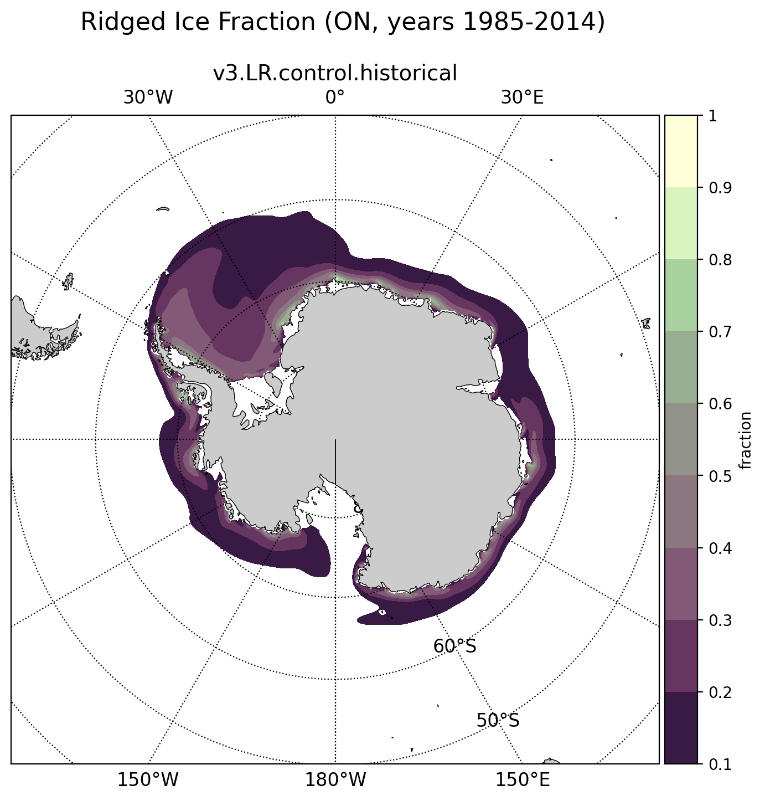

.. _task_climatologyMapSeaIceAreaFractionRidgeSH:

climatologyMapSeaIceAreaFractionRidgeSH
=======================================

An analysis task for plotting maps of Antarctic sea ice ridged area fraction.

Component and Tags::

  component: seaIce
  tags: climatology, horizontalMap, seaIceAreaFractionRidge, publicObs

Configuration Options
---------------------

The following configuration options are available for this task::

  [climatologyMapSeaIceAreaFractionRidgeSH]
  ## options related to plotting horizontally remapped climatologies of
  ## ridged area fraction of sea ice
  ## in the southern hemisphere (SH)

  # colormap for model/observations
  colormapNameResult = tokyo
  # whether the colormap is indexed or continuous
  colormapTypeResult = indexed
  # color indices into colormapName for filled contours
  colormapIndicesResult = [20, 50, 80, 110, 140, 170, 200, 230, 255]
  # colormap levels/values for contour boundaries
  colorbarLevelsResult = [0.1, 0.2, 0.3, 0.4, 0.5, 0.6, 0.7, 0.8, 0.9, 1]

  # colormap for differences
  colormapNameDifference = balance
  # whether the colormap is indexed or continuous
  colormapTypeDifference = indexed
  # color indices into colormapName for filled contours
  colormapIndicesDifference = [0, 32, 64, 96, 112, 128, 128, 144, 160, 192, 224, 255]
  # colormap levels/values for contour boundaries
  colorbarLevelsDifference = [-1., -0.8, -0.6, -0.4, -0.2, -0.1, 0, 0.1, 0.2, 0.4, 0.6, 0.8, 1.]

  # Times for comparison
  seasons =  ['FM', 'ON']

  # comparison grid(s) (typically 'arctic_extended') on which to plot analysis
  comparisonGrids = ['antarctic_extended']

  # arrange subplots vertically?
  vertical = False

The option ``vertical = True`` can be used to plot 3 panels one above another
(resulting in a tall, thin image) rather than next to each other, the default
(resulting in a short, wide image).

For details on the remaining configration options, see:
 * :ref:`config_colormaps`
 * :ref:`config_seasons`
 * :ref:`config_comparison_grids`

Example Result
--------------

