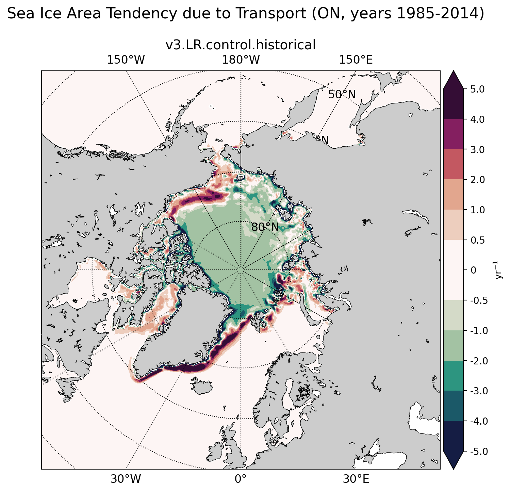

.. _task_climatologyMapSeaIceAreaTendencyTranspNH:

climatologyMapSeaIceAreaTendencyTranspNH
========================================

An analysis task for plotting maps of Arctic sea ice area tendency due to transport.

Component and Tags::

  component: seaIce
  tags: climatology, horizontalMap, seaIceAreaTendencyTransport, publicObs

Configuration Options
---------------------

The following configuration options are available for this task::

  [climatologyMapSeaIceAreaTendencyTranspNH]
  ## options related to plotting horizontally remapped climatologies of
  ## sea ice area tendency due to transport against control model results and observations
  ## in the northern hemisphere (NH)

  # colormap for model/observations
  colormapNameResult = curl
  # whether the colormap is indexed or continuous
  colormapTypeResult = indexed
  # color indices into colormapName for filled contours
  colormapIndicesResult = [0, 32, 64, 96, 112, 128, 128, 144, 160, 192, 224, 255]
  # colormap levels/values for contour boundaries
  colorbarLevelsResult = [-5., -4., -3., -2., -1., -0.5, 0, 0.5, 1., 2., 3., 4., 5.]

  # colormap for differences
  colormapNameDifference = balance
  # whether the colormap is indexed or continuous
  colormapTypeDifference = indexed
  # color indices into colormapName for filled contours
  colormapIndicesDifference = [0, 32, 64, 96, 112, 128, 128, 144, 160, 192, 224, 255]
  # colormap levels/values for contour boundaries
  colorbarLevelsDifference = [-1., -0.8, -0.6, -0.4, -0.2, -0.1, 0, 0.1, 0.2, 0.4, 0.6, 0.8, 1.]

  # Times for comparison
  seasons =  ['FM', 'ON']

  # comparison grid(s) (typically 'arctic_extended') on which to plot analysis
  comparisonGrids = ['arctic_extended']

  # arrange subplots vertically?
  vertical = False

The option ``vertical = True`` can be used to plot 3 panels one above another
(resulting in a tall, thin image) rather than next to each other, the default
(resulting in a short, wide image).

For details on the remaining configration options, see:
 * :ref:`config_colormaps`
 * :ref:`config_seasons`
 * :ref:`config_comparison_grids`

Example Result
--------------

