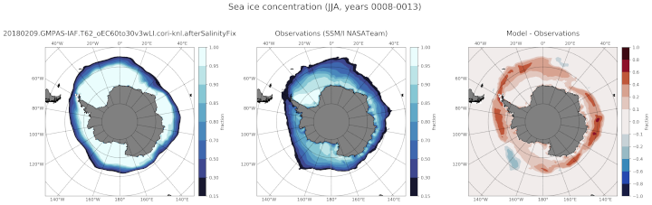

.. _task_climatologyMapSeaIceConcSH:

climatologyMapSeaIceConcSH
==========================

An analysis task for plotting maps of Antarctic sea ice concentration against
observations.

Component and Tags::

  component: seaIce
  tags: climatology, horizontalMap, seaIceConc, publicObs

Configuration Options
---------------------

The following configuration options are available for this task::

  [climatologyMapSeaIceConcSH]
  ## options related to plotting horizontally remapped climatologies of
  ## sea ice concentration against reference model results and observations
  ## in the southern hemisphere (SH)

  # colormap for model/observations
  colormapNameResult = ice
  # color indices into colormapName for filled contours
  colormapIndicesResult = [20, 80, 110, 140, 170, 200, 230, 255]
  # colormap levels/values for contour boundaries
  colorbarLevelsResult = [0.15, 0.3, 0.5, 0.7, 0.8, 0.85, 0.9, 0.95, 1]

  # colormap for differences
  colormapNameDifference = balance
  # color indices into colormapName for filled contours
  colormapIndicesDifference = [0, 32, 64, 96, 112, 128, 128, 144, 160, 192,
                               224, 255]
  # colormap levels/values for contour boundaries
  colorbarLevelsDifference = [-1., -0.8, -0.6, -0.4, -0.2, -0.1, 0, 0.1, 0.2,
                              0.4, 0.6, 0.8, 1.]

  # Months or seasons to plot (These should be left unchanged, since
  # observations are only available for these seasons)
  seasons =  ['DJF', 'JJA']

  # comparison grid(s) ('latlon', 'antarctic') on which to plot analysis
  comparisonGrids = ['latlon']

  # reference lat/lon for sea ice plots in the northern hemisphere
  minimumLatitude = -50
  referenceLongitude = 180

  # a list of prefixes describing the sources of the observations to be used
  observationPrefixes = ['NASATeam', 'Bootstrap']

  # arrange subplots vertically?
  vertical = False

  # observations files
  concentrationNASATeamSH_DJF = SSMI/NASATeam_NSIDC0051/SSMI_NASATeam_gridded_concentration_SH_djf.interp0.5x0.5_20180710.nc
  concentrationNASATeamSH_JJA = SSMI/NASATeam_NSIDC0051/SSMI_NASATeam_gridded_concentration_SH_jja.interp0.5x0.5_20180710.nc
  concentrationBootstrapSH_DJF = SSMI/Bootstrap_NSIDC0079/SSMI_Bootstrap_gridded_concentration_SH_djf.interp0.5x0.5_20180710.nc
  concentrationBootstrapSH_JJA = SSMI/Bootstrap_NSIDC0079/SSMI_Bootstrap_gridded_concentration_SH_jja.interp0.5x0.5_20180710.nc

The option ``minimumLatitude`` determines what the northernmost latitude (in
degrees) included in the plot will be.  The option ``referenceLongitude``
defines which longitude will be at the bottom of the plot.

By default, plots are produced comparing modeled sea ice concentration against
both observations produced with both the ``NasaTeam`` and ``Bootstrap``
algorithms.  By altering ``observationPrefixes``, you can select only one
(or none) of these.

The option ``vertical = True`` can be used to plot 3 panels one above another
(resulting in a tall, thin image) rather than next to each other, the default
(resulting in a short, wide image).

The ability to modify observations files pointed to by
``concentrationNASATeamSH_DJF``, ``concentrationNASATeamSH_JJA``,
``concentrationBootstrapSH_DJF`` and ``concentrationBootstrapSH_JJA`` is
provided for debugging purposes and these options
should typically remain unchanged.

For details on the remaining configration options, see:
 * :ref:`config_colormaps`
 * :ref:`config_seasons`
 * :ref:`config_comparison_grids`

Observations
------------

* :ref:`nasateam_conc`
* :ref:`bootstrap_conc`

Example Result
--------------

