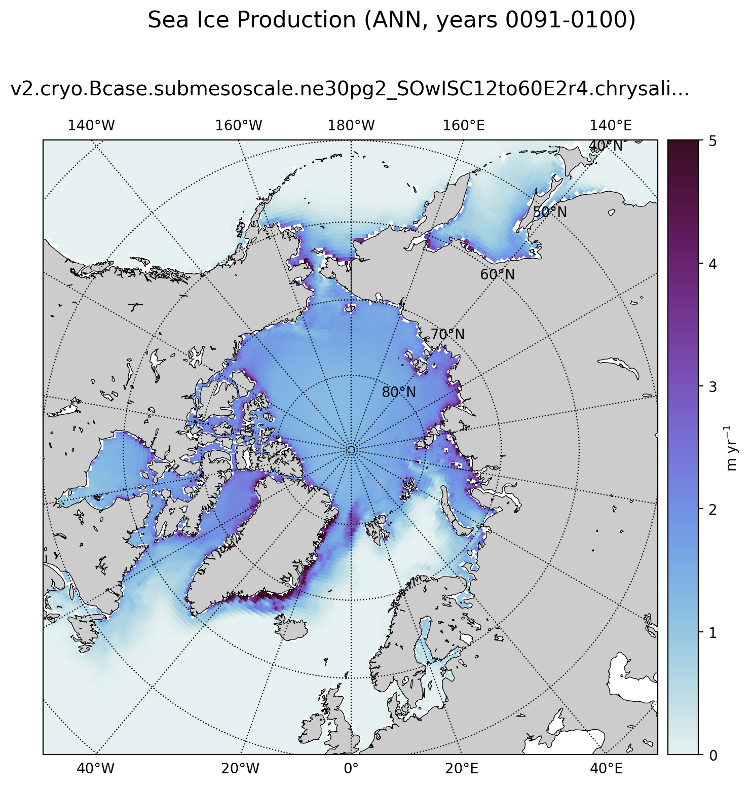

.. _task_climatologyMapSeaIceProductionNH:

climatologyMapSeaIceProductionNH
================================

An analysis task for plotting maps of Arctic sea ice production.

Component and Tags::

  component: seaIce
  tags: climatology, horizontalMap, seaIceProduction, publicObs

Configuration Options
---------------------

The following configuration options are available for this task::

  [climatologyMapSeaIceProductionNH]
  # options related to plotting horizontally remapped climatologies of
  # sea ice production against control model results and observations
  # in the northern hemisphere (NH)

  # colormap for model/observations
  colormapNameResult = dense
  # whether the colormap is indexed or continuous
  colormapTypeResult = continuous
  # the type of norm used in the colormap
  normTypeResult = linear
  # A dictionary with keywords for the norm
  normArgsResult = {'vmin': 0., 'vmax': 5.}
  # place the ticks automatically by default
  # colorbarTicksResult = numpy.linspace(-2., 2., 9)

  # colormap for differences
  colormapNameDifference = balance
  # whether the colormap is indexed or continuous
  colormapTypeDifference = continuous
  # the type of norm used in the colormap
  normTypeDifference = linear
  # A dictionary with keywords for the norm
  normArgsDifference = {'vmin': -3., 'vmax': 3.}
  # place the ticks automatically by default
  colorbarTicksDifference = [-3, -2, -1, 0, 1, 2, 3]

  # Times for comparison times
  seasons =  ['ANN', 'DJF', 'JJA']

  # comparison grid(s) ('latlon', 'antarctic') on which to plot analysis
  comparisonGrids = ['latlon']

  # reference lat/lon for sea ice plots in the northern hemisphere
  minimumLatitude = 50
  referenceLongitude = 0

  # arrange subplots vertically?
  vertical = False

The option ``minimumLatitude`` determines what the northernmost latitude (in
degrees) included in the plot will be.  The option ``referenceLongitude``
defines which longitude will be at the bottom of the plot.

The option ``vertical = True`` can be used to plot 3 panels one above another
(resulting in a tall, thin image) rather than next to each other, the default
(resulting in a short, wide image).

For details on the remaining configration options, see:
 * :ref:`config_colormaps`
 * :ref:`config_seasons`
 * :ref:`config_comparison_grids`

Example Result
--------------

