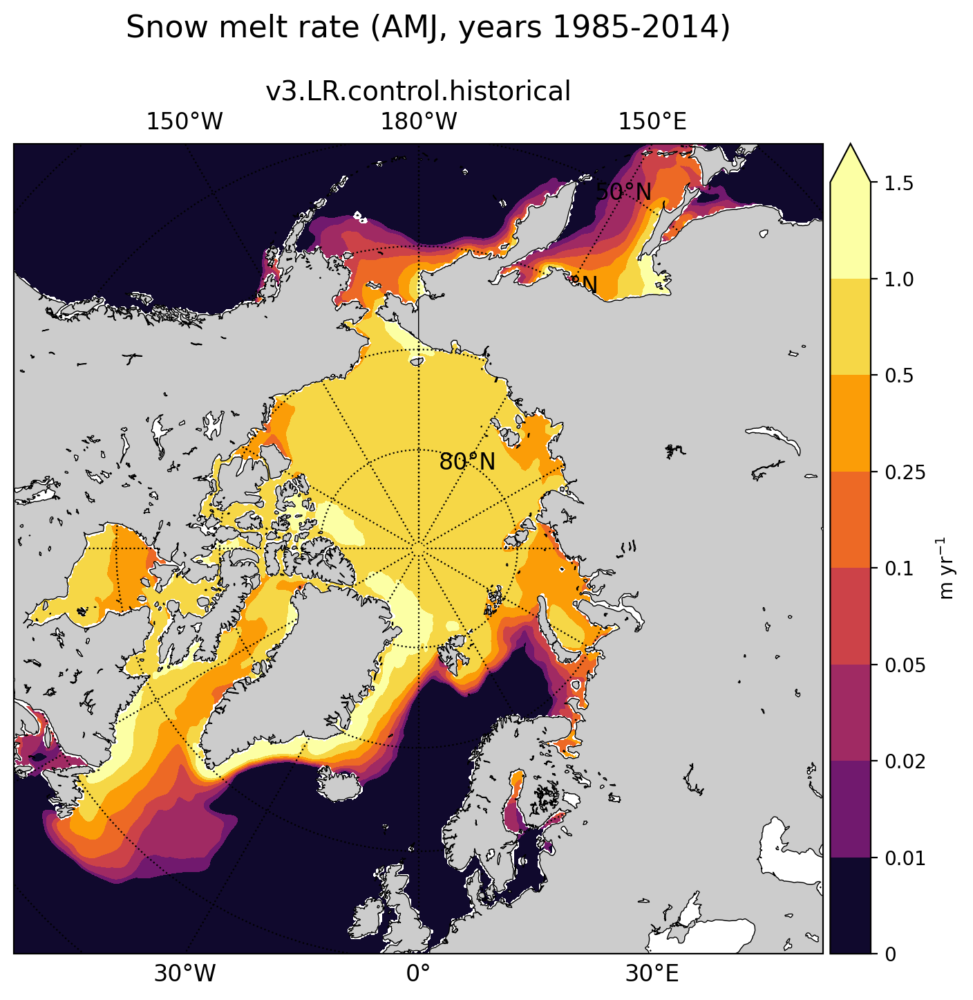

.. _task_climatologyMapSeaIceSnowMeltNH:

climatologyMapSeaIceSnowMeltNH
=======================================

An analysis task for plotting maps of Arctic sea ice cell-averaged snow melt rate.

Component and Tags::

  component: seaIce
  tags: climatology, horizontalMap, seaIceSnowMelt, publicObs

Configuration Options
---------------------

The following configuration options are available for this task::

  [climatologyMapSeaIceSnowMeltNH]
  # options related to plotting horizontally remapped climatologies of
  # snow melt against control model results and observations
  # in the northern hemisphere (NH)

  # colormap for model/observations
  colormapNameResult = inferno
  # whether the colormap is indexed or continuous
  colormapTypeResult = indexed
  # color indices into colormapName for filled contours
  colormapIndicesResult = [20, 80, 110, 140, 170, 200, 230, 255]
  # colormap levels/values for contour boundaries
  colorbarLevelsResult = [0, 0.01, 0.02, 0.05, 0.1, 0.25, 0.5, 1., 1.5]

  # colormap for differences
  colormapNameDifference = balance
  # whether the colormap is indexed or continuous
  colormapTypeDifference = indexed
  # color indices into colormapName for filled contours
  colormapIndicesDifference = [0, 32, 64, 96, 128, 128, 160, 192, 224, 255]
  # colormap levels/values for contour boundaries
  colorbarLevelsDifference = [-0.2, -0.1, -0.05, -0.01, -0.005, 0, 0.005, 0.01, 0.05, 0.1, 0.2]

  # Months or seasons to plot
  seasons =  ['ANN', 'FM', 'ON']

  # comparison grid(s) (typically 'arctic_extended') on which to plot analysis
  comparisonGrids = ['arctic_extended']

  # a list of prefixes describing the sources of the observations to be used
  observationPrefixes = ['']

  # arrange subplots vertically?
  vertical = False

The option ``vertical = True`` can be used to plot 3 panels one above another
(resulting in a tall, thin image) rather than next to each other, the default
(resulting in a short, wide image).

For details on the remaining configration options, see:
 * :ref:`config_colormaps`
 * :ref:`config_seasons`
 * :ref:`config_comparison_grids`

Example Result
--------------

