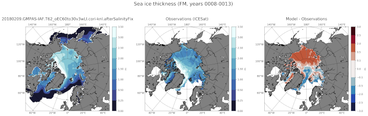

.. _task_climatologyMapSeaIceThickNH:

climatologyMapSeaIceThickNH
===========================

An analysis task for plotting maps of Arctic sea ice thickness against
observations.

Component and Tags::

  component: seaIce
  tags: climatology, horizontalMap, seaIceThick, publicObs

Configuration Options
---------------------

The following configuration options are available for this task::

  [climatologyMapSeaIceThickNH]
  ## options related to plotting horizontally remapped climatologies of
  ## sea ice thickness against reference model results and observations
  ## in the northern hemisphere (NH)

  # colormap for model/observations
  colormapNameResult = ice
  # color indices into colormapName for filled contours
  colormapIndicesResult = [20, 80, 110, 140, 170, 200, 230, 255]
  # colormap levels/values for contour boundaries
  colorbarLevelsResult = [0, 0.25, 0.5, 1, 1.5, 2, 2.5, 3, 3.5]

  # colormap for differences
  colormapNameDifference = balance
  # color indices into colormapName for filled contours
  colormapIndicesDifference = [0, 32, 64, 96, 128, 128, 160, 192, 224, 255]
  # colormap levels/values for contour boundaries
  colorbarLevelsDifference = [-3., -2.5, -2, -0.5, -0.1, 0, 0.1, 0.5, 2, 2.5, 3.]

  # Months or seasons to plot (These should be left unchanged, since
  # observations are only available for these seasons)
  seasons =  ['FM', 'ON']

  # comparison grid(s) ('latlon', 'antarctic') on which to plot analysis
  comparisonGrids = ['latlon']

  # reference lat/lon for sea ice plots in the northern hemisphere
  minimumLatitude = 50
  referenceLongitude = 0

  # a list of prefixes describing the sources of the observations to be used
  observationPrefixes = ['']

  # arrange subplots vertically?
  vertical = False

  # observations files
  thicknessNH_ON = ICESat/ICESat_gridded_mean_thickness_NH_on.interp0.5x0.5_20180710.nc
  thicknessNH_FM = ICESat/ICESat_gridded_mean_thickness_NH_fm.interp0.5x0.5_20180710.nc

The option ``minimumLatitude`` determines what the southernmost latitude (in
degrees) included in the plot will be.  The option ``referenceLongitude``
defines which longitude will be at the bottom of the plot.

The option ``observationPrefixes`` should be left as a list of the empty
string and is included for allowing easy code reuse with the
``climatologyMapSeaIceConc*`` tasks.

The option ``vertical = True`` can be used to plot 3 panels one above another
(resulting in a tall, thin image) rather than next to each other, the default
(resulting in a short, wide image).

The ability to modify observations files pointed to by ``thicknessNH_ON`` and
``thicknessNH_FM`` is provided for debugging purposes and these options
should typically remain unchanged.

For details on the remaining configration options, see:
 * :ref:`config_colormaps`
 * :ref:`config_seasons`
 * :ref:`config_comparison_grids`

Observations
------------

:ref:`icesat_thickness`

Example Result
--------------

