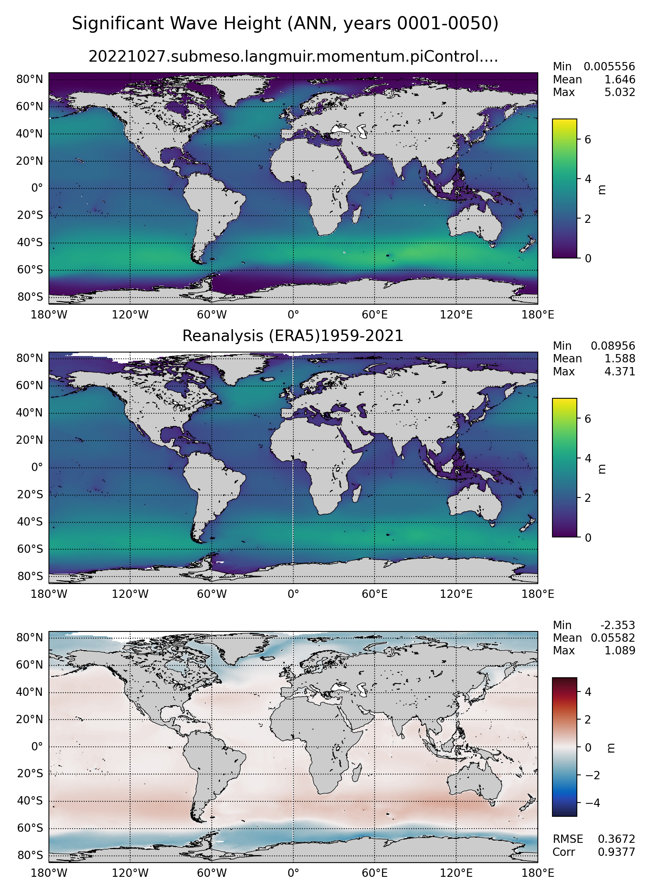
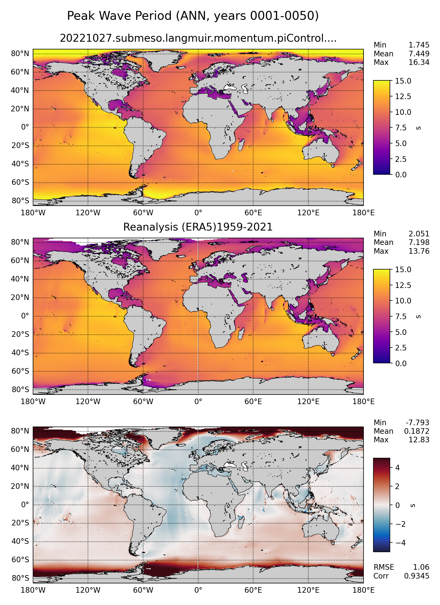

.. _task_climatologyMapWaves:

climatologyMapWaves
=================

An analysis task for comparison of global maps of wave quantities
(significant wave height and peak period) against observations.

Component and Tags::

  component: ocean
  tags: climatology, horizontalMap, waves

Configuration Options
---------------------

The following configuration options are available for this task::

  [climatologyMapWaves]
  ## options related to plotting climatology maps of wave fields
  ## ERA5 climatological data
  
  # comparison grid(s) on which to plot analysis
  comparisonGrids = ['latlon']
  
  # Months or seasons to plot (Jan, Feb, Mar, Apr, May, Jun, Jul, Aug, Sep, Oct,
  # Nov, Dec, JFM, AMJ, JAS, OND, ANN)
  seasons =  ['ANN', 'JFM', 'JAS']
  
  # a list of fields to plot ('significantWaveHeight', 'peakWavePeriod')
  fieldList = ['significantWaveHeight', 'peakWavePeriod']
  
  era5ObsStartYear = 1959
  era5ObsEndYear = 2021 
  sscciObsStartYear = 1991
  sscciObsEndYear = 2018
  
  [climatologyMapWavesSignificantWaveHeight]
  ## options related to plotting climatology maps of significant wave height
  
  # colormap for model/observations
  colormapNameResult = viridis 
  # whether the colormap is indexed or continuous
  colormapTypeResult = continuous
  # the type of norm used in the colormap
  normTypeResult = linear
  # A dictionary with keywords for the norm
  normArgsResult = {'vmin': 0., 'vmax': 7.}
  # place the ticks automatically by default
  # colorbarTicksResult = numpy.linspace(-2., 10., 9)
  
  # colormap for differences
  colormapNameDifference = balance
  # whether the colormap is indexed or continuous
  colormapTypeDifference = continuous
  # the type of norm used in the colormap
  normTypeDifference = linear
  # A dictionary with keywords for the norm
  normArgsDifference = {'vmin': -5., 'vmax': 5.}
  # place the ticks automatically by default
  # colorbarTicksDifference = numpy.linspace(-5., 5., 9)
  
  [climatologyMapWavesPeakWavePeriod]
  ## options related to plotting climatology maps of peak wave frequency
  
  # colormap for model/observations
  colormapNameResult = plasma 
  # whether the colormap is indexed or continuous
  colormapTypeResult = continuous
  # the type of norm used in the colormap
  normTypeResult = linear
  # A dictionary with keywords for the norm
  normArgsResult = {'vmin': 0.0, 'vmax':15.0}
  # place the ticks automatically by default
  # colorbarTicksResult = numpy.linspace(-2., 10., 9)
  
  # colormap for differences
  colormapNameDifference = balance
  # whether the colormap is indexed or continuous
  colormapTypeDifference = continuous
  # the type of norm used in the colormap
  normTypeDifference = linear
  # A dictionary with keywords for the norm
  normArgsDifference = {'vmin': -5., 'vmax': 5.}
  # place the ticks automatically by default
  # colorbarTicksDifference = numpy.linspace(-5., 5., 9)

For more details, see:
 * :ref:`config_colormaps`
 * :ref:`config_seasons`
 * :ref:`config_comparison_grids`

Observations
------------

:ref:`era5_waves`
:ref:`sscci_waves`

Example Result
--------------

