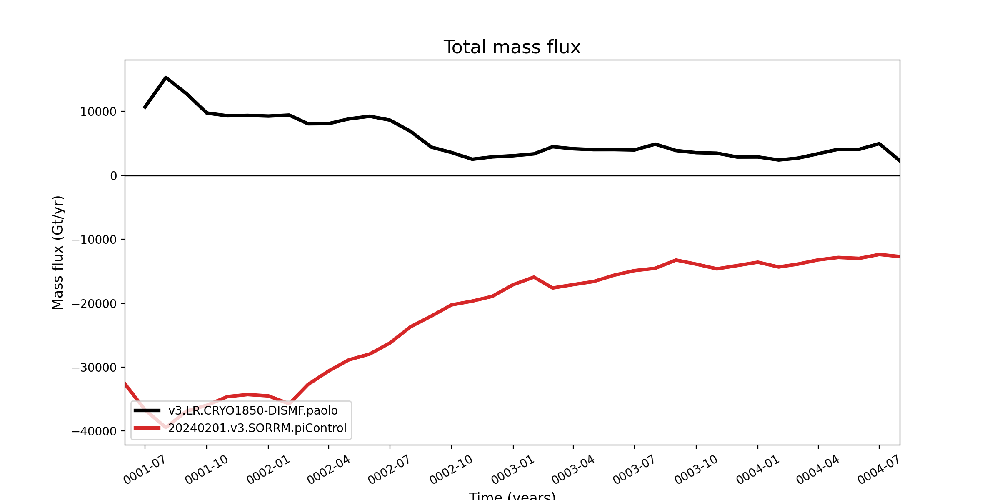

.. _task_conservation:

conservation
============

An analysis task for plotting histograms of 2-d variables of climatologies
in ocean regions.

Component and Tags::

  component: ocean
  tags: timeseries, conservation

Configuration Options
---------------------

The following configuration options are available for this task:

.. code-block:: cfg

    [conservation]
    ## options related to producing time series plots, often to compare against
    ## observations and previous runs
    
    # the year from which to compute anomalies if not the start year of the
    # simulation.  This might be useful if a long spin-up cycle is performed and
    # only the anomaly over a later span of years is of interest.
    # anomalyRefYear = 249
    
    # start and end years for timeseries analysis. Use endYear = end to indicate
    # that the full range of the data should be used.  If errorOnMissing = False,
    # the start and end year will be clipped to the valid range.  Otherwise, out
    # of bounds values will lead to an error.  In a "control" config file used in
    # a "main vs. control" analysis run, the range of years must be valid and
    # cannot include "end" because the original data may not be available.
    startYear = 1
    endYear = end
    
    # Plot types to generate. The following plotTypes are supported:
    #    total_energy_flux : Total energy flux
    #    absolute_energy_error : Energy error
    #    ice_salt_flux : Salt flux related to land ice and sea ice
    #    absolute_salt_error : Salt conservation error
    #    total_mass_flux : Total mass flux
    #    total_mass_change : Total mass anomaly
    #    land_ice_mass_change : Mass anomaly due to land ice fluxes
    #    land_ice_ssh_change : SSH anomaly due to land ice fluxes
    #    land_ice_mass_flux_components : Mass fluxes from land ice
    plotTypes = 'land_ice_mass_flux_components'
    
    # line colors for the main, control and obs curves
    # see https://matplotlib.org/stable/gallery/color/named_colors.html
    # and https://matplotlib.org/stable/tutorials/colors/colors.html
    mainColor = black
    controlColor = tab:red

Example Result
--------------

