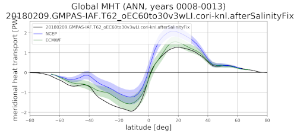

.. _task_meridionalHeatTransport:

meridionalHeatTransport
=======================

An analysis task for plotting the zonal mean meridional heat transport (MHT)
against observations.

Component and Tags::

    component: ocean
    tags: climatology, publicObs

Configuration Options
---------------------

The following configuration options are available for this task::

  [meridionalHeatTransport]
  ## options related to plotting meridional heat transport (MHT)

  # Data source to read for comparison
  observationData = mht_TrenberthCaron.NoAtm_20180710.nc

  # colormap for model results
  colormapName = balance
  # colormap indices for contour color
  colormapIndices = [0, 28, 57, 85, 113, 142, 170, 198, 227, 255]
  # colorbar levels/values for contour boundaries
  colorbarLevels = [-0.1, -0.05, -0.02, -0.01, -0.005, 0, 0.005, 0.01, 0.02,
                    0.05, 0.1]
  # contour line levels
  contourLevels = [-0.1, -0.01, 0.01, 0.1]

  # latitude and depth limits
  xLimGlobal = [-80, 80]
  depthLimGlobal = [-1000, 0]

  # compare to observations?
  compareWithObservations = True

  # plot the vertical section of MHT?
  plotVerticalSection = False

  # Number of points over which to compute moving average (with respect to
  # latitude) for MHT vertical section plots
  movingAveragePoints = 1

The option ``observationData`` allows the selection of the observational file
to compare with (available largely for debugging purposes).

By default, only a line plot of depth-integrated MHT is plotted.  Optionally,
you can set ``plotVerticalSection = True`` to produce a plot of the MHT per
unit depth as a funciton of latitude and depth.  Because this type of plot is
not commonly produced in ocean models and observations are not available for
comparison, it is disabled by default.

The options ``xLimGlobal`` and ``depthLimGlobal`` control the bounds of the
x axis of both plots and the y axis of the vertical section plot, respectively.

For more details on the remaining configuration options, see:
 * :ref:`config_colormaps`
 * :ref:`config_moving_average`

Observations
------------

:ref:`trenberth_mht`

Example Result
--------------

