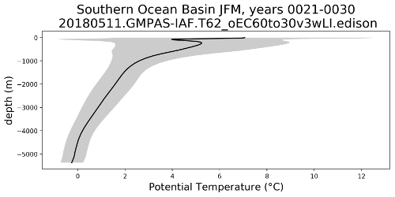

.. _task_oceanRegionalProfiles:

oceanRegionalProfiles
=====================

An analysis task for plotting depth profiles of temperature, salinity,
potential density, etc. averaged over regions and in time. The plots also
include a measure of variability (the standard deviation in space and time).

Component and Tags::

  component: ocean
  tags: profiles, climatology

Configuration Options
---------------------

The following configuration options are available for this task:

.. code-block:: cfg

    [oceanRegionalProfiles]
    ## options related to plotting vertical profiles of regional means (and
    ## variability) of 3D MPAS fields

    # The name of a region group defining the region for each profile
    regionGroups = ['Ocean Basins']

    [profilesOceanBasins]
    ## options related to plotting vertical profiles ocean basins

    # a list of dictionaries for each field to plot.  The dictionary includes
    # prefix (used for file names, task names and sections) as well as the mpas
    # name of the field, units for colorbars and a the name as it should appear
    # in figure titles and captions.
    fields =
        [{'prefix': 'potentialTemperature',
          'mpas': 'timeMonthly_avg_activeTracers_temperature',
          'units': r'$\degree$C',
          'titleName': 'Potential Temperature'},
         {'prefix': 'salinity',
          'mpas': 'timeMonthly_avg_activeTracers_salinity',
          'units': r'PSU',
          'titleName': 'Salinity'},
         {'prefix': 'potentialDensity',
          'mpas': 'timeMonthly_avg_potentialDensity',
          'units': r'kg m$^{-3}$',
          'titleName': 'Potential Density'}]

    # Times for comparison times (Jan, Feb, Mar, Apr, May, Jun, Jul, Aug, Sep, Oct,
    # Nov, Dec, JFM, AMJ, JAS, OND, ANN)
    seasons =  ['JFM', 'JAS', 'ANN']

    # minimum and maximum depth of profile plots, or empty for the full depth range
    depthRange = []

    # a list of region names from the region masks file to plot
    regionNames = ["Atlantic_Basin", "Pacific_Basin", "Indian_Basin",
                   "Arctic_Basin", "Southern_Ocean_Basin", "Mediterranean_Basin",
                   "Global Ocean", "Global Ocean 65N to 65S",
                   "Global Ocean 15S to 15N"]

    # web gallery options
    profileGalleryGroup = Ocean Basin Profiles

The ``[oceanRegionalProfiles]`` section contains a list of ``regionGroups``,
one or more of the :ref:`config_region_groups` defined in
:py:func:`geometric_features.aggregation.get_aggregator_by_name()`.

For each region group, there is a corresponding section
``[profiles<RegionGroup>]``, where ``<RegionGroup>`` is the name of the region
group with spaces removed.  In this section, the ``fields`` dictionary is used
to specify a list of 3D MPAS fields to average and plot.  The key ``prefix`` is
a convenient name appended to tasks and file names to describe the field.
``mpas`` is the name of the field in MPAS ``timeSeriesStatsMonthly`` output
files.  The ``units`` are the SI units of the field to include on the plot's x
axis and ``titleName`` is the name of the field to use in its gallery name and
on the x axis of the profile.

``regionNames`` is a list of regions from the full the region group or
``regionNames = ['all']`` to indicate that all regions should be used.  For
the available regions, see
`Aggregate Existing Features <http://mpas-dev.github.io/geometric_features/stable/aggregation.html>`_.

A config option is available to specify the names of the gallery group for the
profiles (``profileGalleryGroup``).

A minimum and maximum depth for profiles can be specified with ``depthRange``.
The default is the full range.

For more details on the remaining config options, see
 * :ref:`config_region_groups`
 * :ref:`config_seasons`

Example Result
--------------

