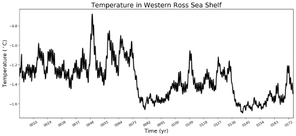

.. _task_timeSeriesOceanRegions:

timeSeriesOceanRegions
======================

An analysis task for plotting time series of of temperature, salinity,
potential density and other fields of interest averaged over ocean regions.

Component and Tags::

  component: ocean
  tags: timeSeries, regions

Configuration Options
---------------------

The following configuration options are available for this task:

.. code-block:: cfg

    [timeSeriesOceanRegions]
    ## options related to plotting time series of groups of ocean regions

    # the names of region groups to plot, each with its own section below
    regionGroups = ['Antarctic Regions']

    [timeSeriesAntarcticRegions]
    ## options related to plotting time series of Antarctic regions

    # list of regions to plot or ['all'] for all regions in the masks file.
    # See "regionNames" in the antarcticRegions masks file in
    # regionMaskSubdirectory for details.
    regionNames = []

    # a list of variables to plot
    variables = [{'name': 'temperature',
                  'title': 'Temperature',
                  'units': r'$^\circ$C',
                  'mpas': 'timeMonthly_avg_activeTracers_temperature'},
                 {'name': 'salinity',
                  'title': 'Salinity',
                  'units': 'PSU',
                  'mpas': 'timeMonthly_avg_activeTracers_salinity'},
                 {'name': 'potentialDensity',
                  'title': 'Potential Density',
                  'units': 'kg m$^{-3}$',
                  'mpas': 'timeMonthly_avg_potentialDensity'},
                 {'name': 'mixedLayerDepth',
                  'title': 'Mixed Layer Depth',
                  'units': 'm',
                  'mpas': 'timeMonthly_avg_dThreshMLD'}]

    # The minimum and maximum depth over which fields are averaged, default is
    # to take these values from the geojson feature's zmin and zmax properties.
    # Add these to a custom config file to override the defaults.
    # zmin = -1000
    # zmax = -400

    # Observational data sets to compare against
    obs = ['SOSE', 'WOA18']

Region Groups
-------------

``regionGroup`` is a list of region groups,each of which will get its own
gallery group on the resulting analysis webpage.  See
:ref:`config_region_groups` for more information on the available region
groups. For each region group, there should be a corresponding
``timeSeries<RegionGroup>`` section of the config file, with any spaces removed
from the name of the region group.  By default, the only region group for this
task is ``'Antarctic Regions'``.

Region Names
------------

The ``regionNames`` can be set to ``['all']`` to plot all of the regions in the
region group.  In the case of ``Antarctic Regions``, these are:

.. code-block:: cfg

    ["Southern Ocean", "Southern Ocean 60S", "Eastern Weddell Sea Shelf",
     "Eastern Weddell Sea Deep", "Western Weddell Sea Shelf",
     "Western Weddell Sea Deep", "Weddell Sea Shelf", "Weddell Sea Deep",
     "Bellingshausen Sea Shelf", "Bellingshausen Sea Deep", "Amundsen Sea Shelf",
     "Amundsen Sea Deep", "Eastern Ross Sea Shelf", "Eastern Ross Sea Deep",
     "Western Ross Sea Shelf", "Western Ross Sea Deep",
     "East Antarctic Seas Shelf", "East Antarctic Seas Deep"]

Variables
---------

The ``variables`` list has a python dictionary for each variable to be plotted.
A separate gallery will be produced for each variable with a title given by
the ``"title"`` entry in the dictionary.  The ``"units"`` entry is used for the
y-axis label of each plot.  The ``"name"`` is the name of the variable in
the NetCDF files as well as the text appended to subtaks names and file names.
It should contain no spaces.  The ``"mpas"`` entry is the name of the
corresponding field in the MPAS-Ocean ``timeSeriesStatsMonthlyOutput`` files.

Depth Bounds
------------

Some region groups such as ``Antarctic Regions`` define default depth bounds
(``zmin`` and ``zmax``) for each region.  For ``Antarctic Regions``, this was
done so regions on the continental shelf (ending in "Shelf") would be averaged
over a different range (``zmax`` = -200 m, ``zmin`` = -1000 m) than the regions
of the deeper ocean (ending in "Deep", with ``zmax`` = -400 m,
``zmin`` = -1000 m).  The user can override these defaults by defining her own
``zmin`` and ``zmax``.  Note that ``zmin`` is deeper and ``zmax`` is shallower
since they have negative values.

Other Config Options
--------------------

For more details, see:
 * :ref:`config_regions`

Observations
------------

``obs`` is a list of the observational data sets to plot as reference lines
(constant in time).  Possible values are ``'SOSE'`` and ``'WOA18'``.  An empty
list can be provided if no observations should be plotted.

:ref:`sose`

:ref:`woa18_t_s`

Example Result
--------------

.. _`antarctic_ocean_regions`: https://github.com/MPAS-Dev/geometric_features/tree/main/feature_creation_scripts/antarctic_ocean_regions
