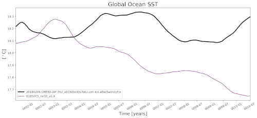

.. _task_timeSeriesSST:

timeSeriesSST
=============

An analysis task for plotting a time series of sea surface temperature (SST),
optionally against results from a preprocessed E3SM v0 run (see
:ref:`config_runs`).

Component and Tags::

  component: ocean
  tags: timeSeries, sst, publicObs

Configuration Options
---------------------

The following configuration options are available for this task::

  [timeSeriesSST]
  ## options related to plotting time series of sea surface temperature (SST)

  # list of regions to plot from the region list in [regions] below
  regions = ['global']

  # Number of points over which to compute moving average (e.g., for monthly
  # output, movingAveragePoints=12 corresponds to a 12-month moving average
  # window)
  movingAveragePoints = 12

  # An optional first year for the tick marks on the x axis. Leave commented out
  # to start at the beginning of the time series.

  # firstYearXTicks = 1

  # An optional number of years between tick marks on the x axis.  Leave
  # commented out to determine the distance between ticks automatically.

  # yearStrideXTicks = 1

For more details on these config options, see:
 * :ref:`config_regions`
 * :ref:`config_moving_average`
 * :ref:`config_time_axis_ticks`

Example Result
--------------

