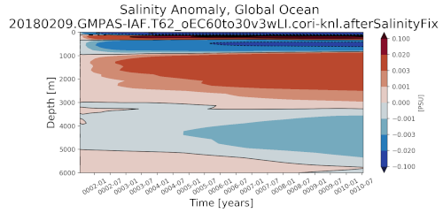

.. _task_timeSeriesSalinityAnomaly:

timeSeriesSalinityAnomaly
=========================

An analysis task for plotting a Hovmoller plot (time and depth axes) of the
anomaly in ocean salinity from a reference year (usully the first year of
the simulation).

Component and Tags::

  component: ocean
  tags: timeSeries, salinity, publicObs

Configuration Options
---------------------

The following configuration options are available for this task::

  [hovmollerSalinityAnomaly]
  ## options related to plotting time series of salinity vs. depth

  # list of regions to plot from the region list in [regions] below
  regions = ['global']

  # Number of points over which to compute moving average(e.g., for monthly
  # output, movingAveragePoints=12 corresponds to a 12-month moving average
  # window)
  movingAveragePoints = 12

  # colormap
  colormapName = balance
  # color indices into colormapName for filled contours
  colormapIndices = [0, 28, 57, 85, 113, 142, 170, 198, 227, 255]
  # colormap levels/values for contour boundaries
  colorbarLevels = [-0.1, -0.02, -0.003, -0.001, 0, 0.001, 0.003, 0.02, 0.1]
  # contour line levels
  contourLevels = np.arange(-0.1, 0.11, 0.02)

  # An optional first year for the tick marks on the x axis. Leave commented out
  # to start at the beginning of the time series.

  # firstYearXTicks = 1

  # An optional number of years between tick marks on the x axis.  Leave
  # commented out to determine the distance between ticks automatically.

  # yearStrideXTicks = 1

For more details, see:
 * :ref:`config_regions`
 * :ref:`config_colormaps`
 * :ref:`config_moving_average`
 * :ref:`config_time_axis_ticks`

Example Result
--------------

