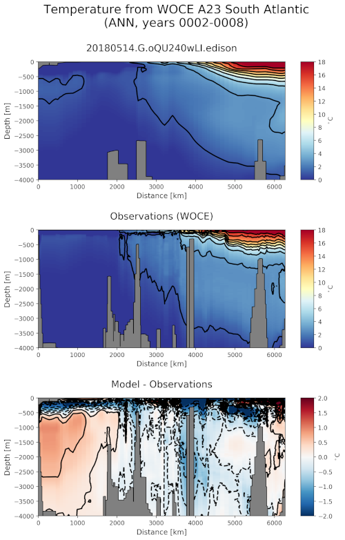

.. _task_woceTransects:

woceTransects
=============

An analysis task for interpolating MPAS fields to
`World Ocean Circulation Experiment (WOCE)`_ transects and comparing them with
ship-based observations.

Component and Tags::

    component: ocean
    tags: climatology, transect, woce

Configuration Options
---------------------

The following configuration options are available for this task::

    [woceTransects]
    ## options related to plotting model vs. World Ocean Circulation Experiment
    ## (WOCE) transects.

    # Times for comparison times (Jan, Feb, Mar, Apr, May, Jun, Jul, Aug, Sep, Oct,
    # Nov, Dec, JFM, AMJ, JAS, OND, ANN)
    seasons =  ['ANN']

    # The approximate horizontal resolution (in km) of each transect.  Latitude/
    # longitude between observation points will be subsampled at this interval.
    # Use 'obs' to indicate no subsampling.
    horizontalResolution = obs

    # The name of the vertical comparison grid.  Valid values are 'mpas' for the
    # MPAS vertical grid, 'obs' to use the locations of observations or
    # any other name if the vertical grid is defined by 'verticalComparisonGrid'
    # verticalComparisonGridName = obs
    verticalComparisonGridName = uniform_0_to_4000m_at_10m
    #verticalComparisonGridName = mpas

    # The vertical comparison grid if 'verticalComparisonGridName' is not 'mpas' or
    # 'obs'.  This should be numpy array of (typically negative) elevations (in m).
    verticalComparisonGrid = numpy.linspace(0, -4000, 401)

    # The minimum weight of a destination cell after remapping. Any cell with
    # weights lower than this threshold will therefore be masked out.
    renormalizationThreshold = 0.01

    [woceTemperatureTransects]
    ## options related to plotting WOCE transects of potential temperature

    # colormap for model/observations
    colormapNameResult = RdYlBu_r
    # the type of norm used in the colormap (linear, log, or symLog)
    normTypeResult = linear
    # A dictionary with keywords for the norm
    normArgsResult = {'vmin': 0.0, 'vmax': 18.0}
    # color indices into colormapName for filled contours
    #colormapIndicesResult = [0, 40, 80, 110, 140, 170, 200, 230, 255]
    # colormap levels/values for contour boundaries
    #colorbarLevelsResult = [0, 1, 2, 3, 4, 6, 8, 10, 14, 18]
    # place the ticks automatically by default
    # colorbarTicksResult = numpy.linspace(0.0, 18.0, 9)
    # contour line levels
    contourLevelsResult = np.arange(1.0, 18.0, 2.0)

    # colormap for differences
    colormapNameDifference = RdBu_r
    # the type of norm used in the colormap (linear, log, or symLog)
    normTypeDifference = linear
    # A dictionary with keywords for the norm
    normArgsDifference = {'vmin': -2.0, 'vmax': 2.0}
    # color indices into colormapName for filled contours
    #colormapIndicesDifference = [0, 28, 57, 85, 113, 128, 128, 142, 170, 198, 227, 255]
    # colormap levels/values for contour boundaries
    #colorbarLevelsDifference = [-2, -1.5, -1.25, -1, -0.2, 0, 0.2, 1, 1.25, 1.5, 2]
    # place the ticks automatically by default
    # colorbarTicksDifference = numpy.linspace(-2.0, 2.0, 9)
    # contour line levels
    contourLevelsDifference = np.arange(-1.8, 2.0, 0.4)

    [woceSalinityTransects]
    ## options related to plotting WOCE transects of salinity

    # colormap for model/observations
    colormapNameResult = BuOr
    # the type of norm used in the colormap (linear, log, or symLog)
    normTypeResult = linear
    # A dictionary with keywords for the norm
    normArgsResult = {'vmin': 33.0, 'vmax': 36.0}
    # color indices into colormapName for filled contours
    #colormapIndicesResult = [0, 40, 80, 110, 140, 170, 200, 230, 255]
    # colormap levels/values for contour boundaries
    #colorbarLevelsResult = [33, 34, 34.25, 34.5, 34.6, 34.7, 34.8, 34.9, 35, 36]
    # place the ticks automatically by default
    # colorbarTicksResult = numpy.linspace(33.0, 36.0, 9)
    # contour line levels
    contourLevelsResult = np.arange(33.3, 36.0, 0.3)

    # colormap for differences
    colormapNameDifference = RdBu_r
    # the type of norm used in the colormap (linear, log, or symLog)
    normTypeDifference = linear
    # A dictionary with keywords for the norm
    normArgsDifference = {'vmin': -1.0, 'vmax': 1.0}
    # color indices into colormapName for filled contours
    #colormapIndicesDifference = [0, 28, 57, 85, 113, 128, 128, 142, 170, 198, 227, 255]
    # colormap levels/values for contour boundaries
    #colorbarLevelsDifference = [-1, -0.5, -0.2, -0.05, -0.02, 0,  0.02, 0.05, 0.2, 0.5, 1]
    # place the ticks automatically by default
    # colorbarTicksDifference = numpy.linspace(-1.0, 1.0, 9)
    # contour line levels
    contourLevelsDifference = np.arange(-0.9, 1.0, 0.4)

For details on these configuration options, see:
 * :ref:`config_transects`
 * :ref:`config_remapping`
 * :ref:`config_colormaps`
 * :ref:`config_seasons`

Observations
------------

:ref:`woce`

Example Result
--------------

.. _`World Ocean Circulation Experiment (WOCE)`: http://woceatlas.ucsd.edu/
